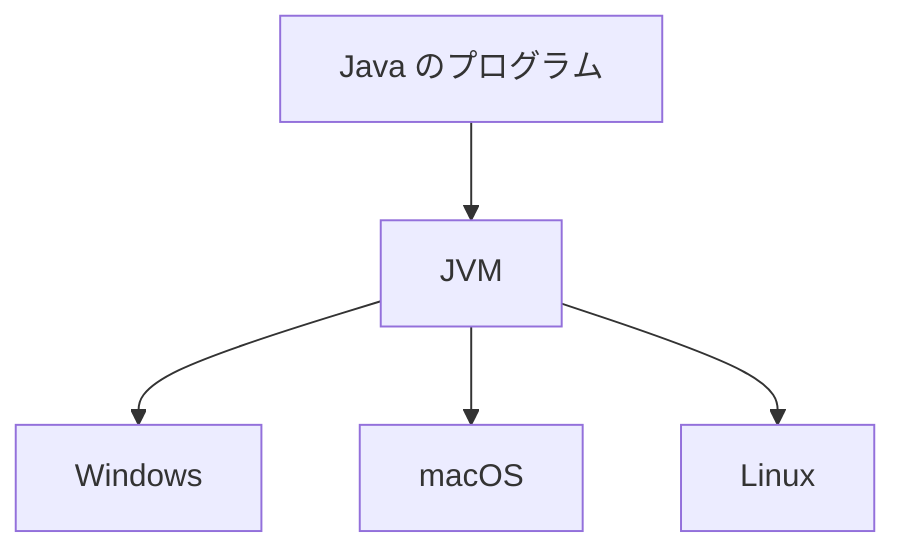

## このセクションで学ぶこと

- Java が静的型・コンパイル型の堅実な言語であることを理解する
- 「どこでも動く」仕組みと豊富なエコシステムが定番たる理由を押さえる
- Java が得意な場面と、向きにくい場面を区別できる

## 堅実さを重視した言語

**Java** は、銀行・保険・大企業の社内システムといった、止まると困る大規模な業務システムで長年使われてきた定番の言語です。性格は前章までに出てきた軸でいうと、**静的型**で、実行前に**コンパイル**するタイプにあたります。

つまり、変数の型をあらかじめ決め、実行する前に文法や型のチェックを通します。手早く書くより、**間違いを早く見つけ、大人数で長く保守できること**を重視した設計です。たくさんの人が同じコードを触り、何年も動かし続ける業務システムでは、この「堅実さ」が大きな価値になります。書く量はやや多くなりますが、後から読んだ人が意図を追いやすい、という利点と裏表の関係です。

## 「どこでも動く」とエコシステムの厚み

Java を語るうえで欠かせないのが **JVM**(Java Virtual Machine)という土台です。Java のプログラムは、Windows・macOS・Linux といった OS の違いを JVM が吸収してくれるため、**一度作れば環境を選ばず同じように動かしやすい**という特徴があります。サーバの種類がまちまちな大きな組織では、これが扱いやすさにつながります。

もう一つの強みが**エコシステム**の厚みです。長く使われてきたぶん、業務でよく使う部品(データベース連携、認証、大量データ処理など)のライブラリや情報、扱える人材が豊富にそろっています。「新しく作る」のではなく「実績のある部品を組み合わせて堅く作る」ことに向いた環境が整っているわけです。

## 得意な場面と向きにくい場面

Java が向くのは、**長く安定して動かす大規模なサーバ・業務システム**や、Android アプリの開発などです。多くの人が同じコードに関わり、何年も保守し続ける現場では、型による事前チェックと厚いエコシステムが効いて、変更時のミスを抑えやすくなります。

一方で、ちょっとした自動化スクリプトや、素早く試作したい小さなツールには、書く量が多く準備の手間もあるため大げさになりがちです。たとえば「ファイルを一括で名前変更したい」程度の用途で Java を持ち出すと、型の宣言やコンパイルの段取りが先に立ち、目的に対して重たく感じられます。そうした用途には、より手早く書ける Python や JavaScript のほうが向きます。規模と寿命の大きいものほど Java の堅実さが効く、と覚えておくとよいでしょう。

## まとめ

- Java は静的型・コンパイル型で、堅実さと長期保守を重視した定番言語。
- JVM により OS を選ばず動かしやすく、業務向けのエコシステムも厚い。
- 大規模・長寿命のシステムに強い反面、小さな試作や自動化には大げさになりやすい。
