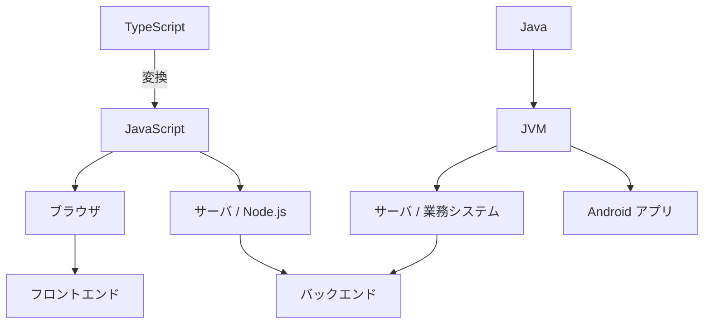

## このセクションで学ぶこと

- JavaScript / TypeScript / Java の実行環境と主な用途の違いを一枚で整理する
- 「どこで動くか」「型があるか」という軸で 3 言語を位置づけられる
- 目的から逆算して 3 言語のどれを選ぶかの目安をつかむ

## 3 言語を「どこで動くか」で並べる

ここまで JavaScript・TypeScript・Java を別々に見てきました。最後に、3 つを一枚の図にまとめて頭の中を整理しておきましょう。整理の軸として分かりやすいのは、**「どこで動くか(実行環境)」**と**「型があるか」**の 2 つです。

まず実行環境から見ると、JavaScript と TypeScript はブラウザの中でもサーバ側(Node.js)でも動きます。とくにブラウザの中で動かせるのはこの系統だけなので、利用者が直接触れる**フロントエンド**は実質ここが担当します。一方の Java は、ブラウザの中では動かず、JVM という土台の上で動くのが基本です。サーバ側の**バックエンド**や Android アプリが主な居場所になります。

図のとおり、TypeScript は最終的に JavaScript に変換されて動くので、実行環境としては JavaScript と同じ場所に立ちます。TypeScript は「JavaScript に型という安全装置を足したもの」と捉えると、3 言語の位置関係がすっきりします。

## 「型があるか」で性格を分ける

もう一つの軸が型の有無です。素の JavaScript は**動的型**で、手早く書ける反面、型の取り違えに実行するまで気づきにくい弱点があります。TypeScript はそこに型を加え、ミスを実行前に見つけやすくしたものでした。Java はもともと**静的型**で、最初から型を決めて堅く作る言語です。

つまり、同じ「型で守る」でも、JavaScript の世界に後から安全を足したのが TypeScript、最初から堅さを前提にしているのが Java、という違いがあります。小さく素早く始めるなら JavaScript、規模が育って安全に保守したいなら TypeScript、大規模で長く動かす業務システムなら Java、という流れで考えると選びやすくなります。

## 目的から逆算して選ぶ

実務では「言語を決めてから用途を考える」のではなく、**用途を決めてから言語を選ぶ**のが基本です。Web ページに動きをつけたい・ブラウザ側を作りたいなら JavaScript / TypeScript、その中でも規模が大きくチームで保守するなら TypeScript が有力です。止まると困る大規模な業務システムや Android アプリなら Java が定番の選択肢になります。

迷ったときは、この章で見た「どこで動くか」と「どれだけ堅く作りたいか」を思い出してください。3 言語はライバルというより、**役割が少しずつ違う道具**です。場面に応じて使い分ける、あるいは組み合わせて使う、という見方ができれば十分です。

## まとめ

- JavaScript / TypeScript はブラウザとサーバの両方、Java は JVM 上のサーバや Android が主な居場所。
- 素の JavaScript は動的型、TypeScript は型を足したもの、Java は最初から静的型という違いがある。
- 言語を先に決めず、用途と求める堅さから逆算して 3 言語を使い分けるのがコツ。
