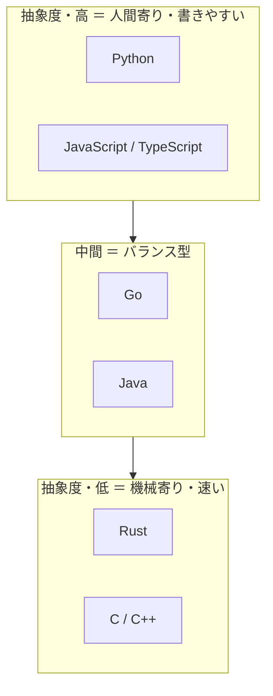

## このセクションで学ぶこと

- 「抽象度」という軸で言語を一列に並べて捉えられる
- これまで登場した言語が地図上のどこに位置するかをイメージできる
- 抽象度の高い・低いそれぞれのトレードオフを言葉にできる

## 言語を並べる軸 ― 抽象度

ここまで多くの言語を見てきました。最後に、それらを **抽象度** という 1 本の軸で並べ直してみましょう。抽象度とは「ハードウェアの細かい事情をどれだけ隠してくれているか」の度合いです。

抽象度が **高い**(=人間寄りの)言語は、メモリの番地や CPU の動きを意識せずに済み、考えていることをそのまま書けます。これを **高水準言語** と呼び、Python や JavaScript が代表です。逆に抽象度が **低い**(=機械寄りの)言語は、ハードウェアを直接操作できますが、その細部まで自分で面倒を見る必要があります。こちらは **低水準言語** で、C / C++ が代表です。

ここで注意したいのは、「低水準=性能が低い」ではない、ということです。むしろ逆で、低水準言語ほどハードウェアの力を引き出せて速くなりがちです。低い・高いはあくまで「抽象度=ハードウェアからの距離」を指す言葉で、良し悪しの順位ではありません。距離が近いほど機械を細かく操れ、遠いほど人間が楽に書ける、という関係を押さえておきましょう。

## 具体例 ― 一枚の地図に並べる

これまで登場した言語を、機械寄り(下)から人間寄り(上)へ並べると、次のようになります。

上にいくほど書きやすく学びやすい一方、ハードウェアの細かい制御はしにくくなります。下にいくほど速度や省メモリを突き詰められますが、書く難しさと事故のリスクが上がります。Go や Java を「中間」に置いたのは、ある程度の速さを持ちつつ、メモリ管理は言語が肩代わりしてくれて書きやすさも両立しているからです。多くの業務開発がこの中間あたりを選ぶのは、速さと書きやすさのバランスが実務に合うことが多いためです。Rust は低水準の速さを保ちながら安全性を上乗せした、いわば「低水準だけど安全」という独自の立ち位置にいます。なお SQL や Swift のような **用途特化言語** は、速い・遅いという同じ物差しでは測れないので、この縦軸とは別の「専門店」棚にあると考えると整理しやすいでしょう。

## 注意点 ― 上下に優劣はない

地図で上にあるから偉い、下にあるから難しくて凄い、という優劣ではありません。これはあくまで **トレードオフの位置**を示すものです。やりたいことが「速く動く OS の一部」なら下を、「素早く作る Web アプリ」なら上を選ぶ ― それだけのことです。大事なのは、目の前の用途がこの地図のどこを必要としているかを見極める目です。次の章では、いよいよ「この用途ならこの言語」という早見表で、地図の読み方を実践に落とし込みます。

## まとめ

- 言語は「抽象度」という軸で人間寄り〜機械寄りに並べられる。
- Python は高水準、C / C++ は低水準、Go や Java はその中間に位置する。
- 上下に優劣はなく、用途が地図のどこを必要とするかで選ぶ。
