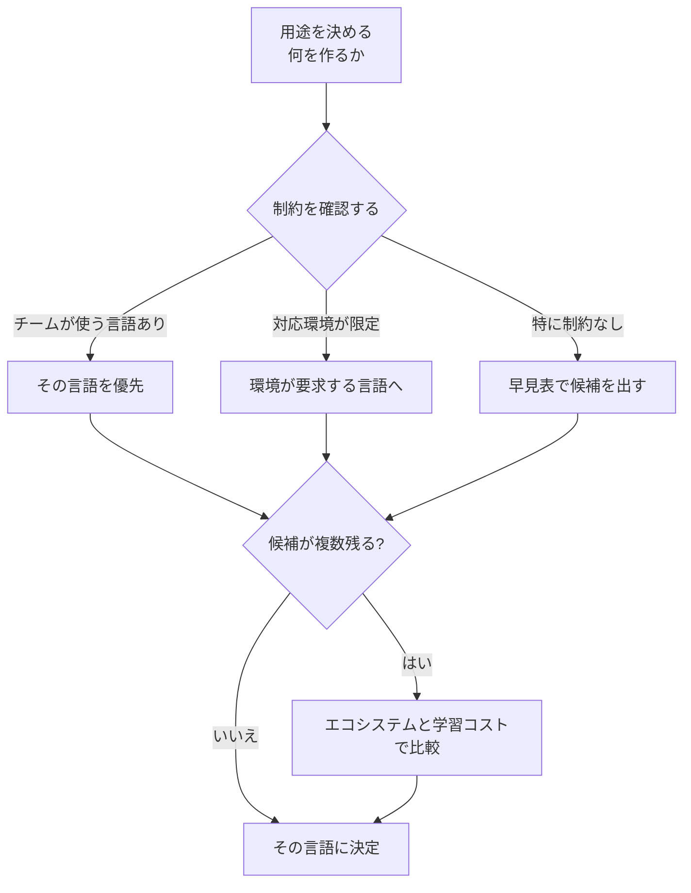

## このセクションで学ぶこと

- 言語選びを「用途 → 制約 → 候補 → 決定」の手順に分解できる
- 性能や型だけでなく、環境やチームの事情が選定に効くと理解する
- フローチャートに沿って自分のケースを当てはめられる

## 言語選びは 4 ステップに分解できる

早見表で候補を数個まで絞ったあと、最後の 1 つを選ぶには順序立てた判断が役立ちます。ここでは選定を「用途 → 制約 → 候補 → 決定」という 4 つのステップに分けて考えます。行き当たりばったりで「人気だから」「なんとなく良さそうだから」と決めるより、各ステップを言葉にできると、後でチームや上司に「なぜその言語にしたのか」を説明しやすくなります。判断の理由を残せることは、技術選定では正解そのものと同じくらい大切です。

## 各ステップで見るポイント

**1. 用途を決める**。「ブラウザで動く画面を作る」「CSV を集計する」など、できるだけ具体的に言葉にします。用途が曖昧だと候補も絞れません。

**2. 制約を確認する**。ここが初級者の見落としがちな点です。たとえば iPhone アプリは Swift、Android は Kotlin というように、対応環境が言語をほぼ決めてしまう場合があります。また、すでにチームが Python で書いているなら、よほどの理由がなければ Python に合わせるのが現実的です。制約は候補を一気に減らす強力な条件です。

**3. 候補を出す**。制約で決まらなければ、前のセクションの早見表で第一候補と次点を並べます。ここで候補が 1 つしか残らなければ、その時点で実質的に決定です。複数残ったら次のステップに進みます。候補を「無数の言語」から「数個の有力候補」まで減らせていれば、この段階はうまくいっています。

**4. 比較して決める**。候補が複数残ったら、第 1 章で学んだ比較軸 ― 速度・型・エコシステム・学習コスト ― で見比べます。どの軸を重く見るかは立場によって変わります。大量のリクエストをさばくサーバなら速度や型の堅牢さが効きますが、初級者の独学なら、速度より「情報の多さ(エコシステム)」と「学習コストの低さ」を重く見るのが無難です。つまずいたときに検索して答えが見つかるかどうかが、独学では何より続けやすさに直結するからです。

## 注意点 ― 「正解は 1 つ」ではない

この手順を踏んでも、最後まで 2 つの候補が並ぶことはよくあります。たとえば Web サーバを Python にするか Go にするかは、性能要件やチームの好みで分かれます。大事なのは「完璧な唯一の正解を探す」ことではなく、「理由を説明できる選択をする」ことです。後から別の言語が必要になっても、ここで学んだ比較軸はそのまま使い回せます。

## まとめ

- 言語選びは「用途 → 制約 → 候補 → 決定」の 4 ステップに分けられます。
- 環境やチームの既存言語といった制約が、性能より先に候補を絞ることが多いです。
- 候補が複数残ったら速度・型・エコシステム・学習コストで比較します。
