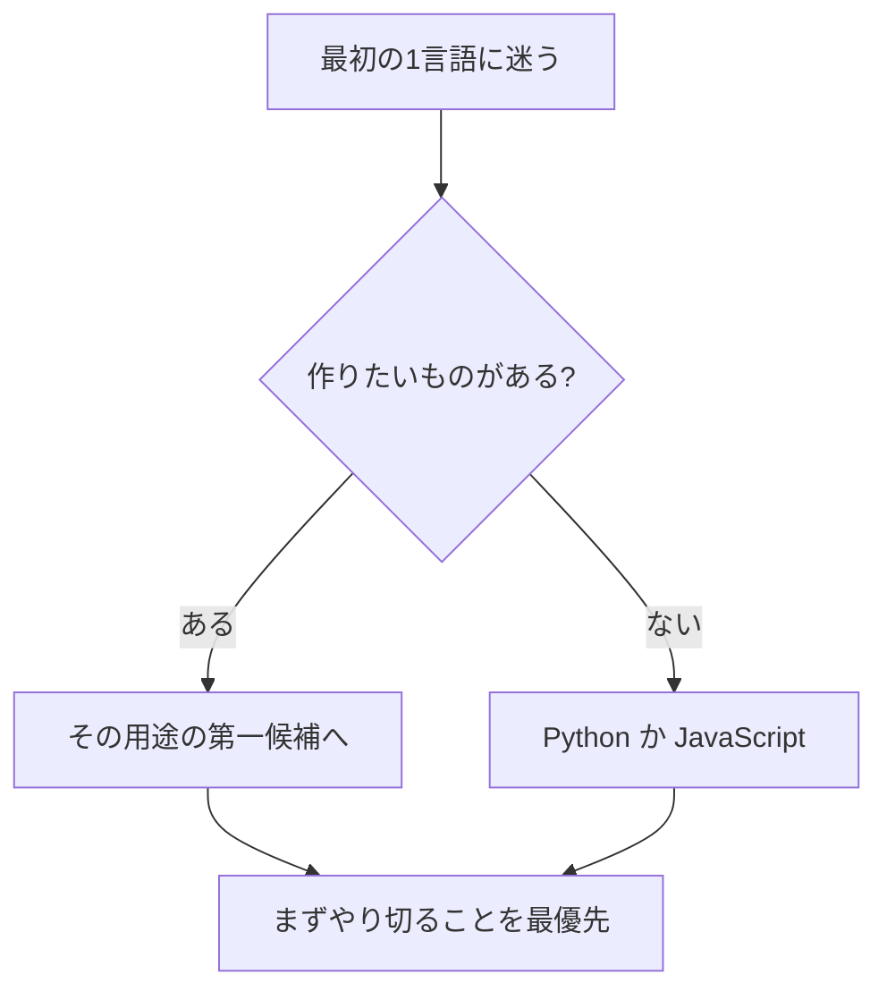

## このセクションで学ぶこと

- 最初の 1 言語は「目的」と「挫折しにくさ」で選ぶとよいと理解する
- 1 言語を身につければ次の言語は学びやすくなると知る
- 迷ったときの無難な選択肢を具体的に言える

## 最初の 1 言語は「完璧な言語」でなくてよい

学び始める前に「どの言語が一番いいのか」を比べすぎて、いつまでも始められない ― これは初学者がはまりやすい落とし穴です。前のセクションの手順は仕事で言語を選ぶ場面の話でした。一方、学習の最初の 1 言語に求められるものは少し違います。最優先は「最後まで挫折せずに 1 つやり切れること」です。

なぜなら、プログラミングの考え方(変数・条件分岐・繰り返し・関数など)は言語が違っても大きく共通しているからです。1 つの言語でこの土台を身につければ、2 つ目以降の言語は「書き方の違い」を覚えるだけで済み、驚くほど早く読めるようになります。逆に言えば、最初にどの言語を選んでも、ここで身につく考え方の大部分は無駄になりません。だからこそ「一番いい言語はどれか」を延々と比べるより、早く 1 つに決めて手を動かしたほうが得なのです。最初の言語は「ゴール」ではなく「土台づくり」だと考えてください。

## 目的があるなら、その用途の言語から

すでに作りたいものがはっきりしているなら、話は簡単です。早見表どおり、その用途の第一候補から始めるのが一番モチベーションが続きます。

- データ分析や自動化に興味がある → Python
- Web ページに動きをつけたい → JavaScript
- iPhone アプリを作りたい → Swift

「作りたいもの」が動くと学習は一気に楽しくなります。多少学習コストが高くても、目的が明確なら乗り越えやすいものです。

## 特に目的がないなら無難な 2 択

「とりあえず始めたいが目的は決まっていない」場合は、Python か JavaScript が無難です。どちらも学習コストが低く、教材や情報が圧倒的に多く、質問できる相手も見つけやすいためです。エラーで詰まっても、検索すれば同じ悩みにぶつかった先人の解決策がほぼ確実に見つかります。この「困ったときに答えが見つかる安心感」は、独学を最後まで続けるうえで想像以上に大きな支えになります。どちらを選ぶか迷うなら、データや自動化に少しでも興味があれば Python、Web の画面まわりに惹かれるなら JavaScript、というくらいの軽さで決めて構いません。

注意点として、最初から複数の言語を並行して学ぶのは避けましょう。文法が混ざって混乱し、どちらも中途半端になりがちです。まず 1 つに集中し、土台ができてから 2 つ目に進むのが結局いちばんの近道です。

## まとめ

- 最初の 1 言語は「やり切れること」を最優先に選びます。
- 作りたいものがあるなら、その用途の第一候補から始めます。
- 迷うなら Python か JavaScript。並行学習は避け、まず 1 つに集中します。
