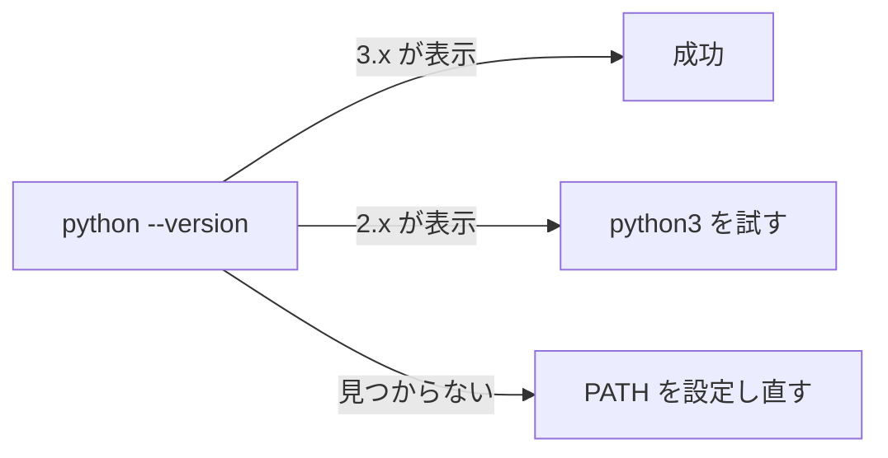

## このセクションで学ぶこと

- 自分のパソコンに Python をインストールできる
- python コマンドでバージョンを確認できる
- python と python3 など複数のコマンド名の違いを理解する

## まず Python を用意する

Python のプログラムを動かすには、パソコンに Python 本体を**インストール**する必要があります。最も確実なのは、公式サイト([python.org](https://www.python.org/downloads/))から自分の OS 向けのインストーラをダウンロードする方法です。執筆時点の安定版は 3 系(Python 3)であり、本教材も Python 3 を前提とします。

OS 別の代表的な入れ方は次のとおりです。

- **Windows**:公式インストーラを実行します。途中の画面で「Add Python to PATH」というチェックボックスがあるので、**必ずチェックを入れて**から進めてください。これを忘れると後でコマンドが使えません。
- **macOS**:公式インストーラのほか、Homebrew を使う場合は `brew install python` でも導入できます。
- **Linux**:多くのディストリビューションに最初から入っています。なければ `sudo apt install python3` などパッケージマネージャで導入します。

## 具体例:インストールを確認する

インストールできたかどうかは、**ターミナル**(Windows ならコマンドプロンプトや PowerShell)を開いて、次のコマンドで確認します。

```bash
python --version
```

うまくいっていれば、次のようにバージョン番号が表示されます。

```text
Python 3.12.3
```

数字はインストールした版によって変わりますが、`Python 3.x.x` のように **3 で始まる**ことを確認できれば成功です。

## 注意点:python と python3 の違い

環境によっては `python` ではなく `python3` というコマンド名になっていることがあります。これは過去に Python 2 系と 3 系が併存していた名残です。

- `python --version` でエラーや「2.x」が出る場合は、`python3 --version` を試してください。
- macOS や Linux では `python3` が標準的なことが多いです。

もし「コマンドが見つからない」と言われる場合は、**PATH** の設定が漏れている可能性が高いです。Windows ならインストーラをやり直して「Add Python to PATH」にチェックを入れるのが手早い解決策です。本教材では以降、コマンドを `python` と表記しますが、お使いの環境に合わせて `python3` に読み替えてください。



## まとめ

- 公式サイトから OS に合った Python 3 をインストールする。
- `python --version` でバージョンを確認できれば導入は成功。
- 環境により `python3` を使う。動かないときは PATH 設定を疑う。
