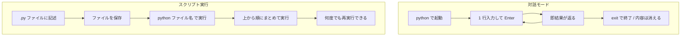

## このセクションで学ぶこと

- .py ファイルに Python のコードを書ける
- `python ファイル名` でスクリプトを実行できる
- 対話モードとスクリプト実行の使い分けを説明できる

## スクリプトファイルとは

対話モードは手軽ですが、内容が保存されません。何度も使う処理や、複数行にわたるまとまったプログラムは、**スクリプトファイル**に書いて保存します。Python のスクリプトファイルは、**拡張子**を `.py` にしたただのテキストファイルです。

たとえばメモ帳やエディタ(VS Code など)で、次の内容を `hello.py` という名前で保存します。

```python
print("Hello, Python!")
print("スクリプトから実行しています")
```

ファイルは好きな場所に保存して構いませんが、保存したフォルダを覚えておいてください。実行時に必要になります。

## 具体例:スクリプトを実行する

保存したスクリプトは、ターミナルから `python` コマンドにファイル名を渡して実行します。まず保存したフォルダ(**カレントディレクトリ**)に移動してから実行するのが基本です。

```bash
python hello.py
```

実行すると、ファイルに書いた `print` が上から順に動き、結果が表示されます。

```text
Hello, Python!
スクリプトから実行しています
```

「ファイルが見つからない」と言われる場合は、ターミナルのカレントディレクトリと、ファイルを保存したフォルダがずれている可能性が高いです。`cd` コマンドで保存先フォルダに移動してから再実行してください。

## 対話モードとの使い分け

対話モードとスクリプト実行は、目的に応じて使い分けます。流れで対比すると違いがはっきりします。



- **対話モード**:1 行ずつ試す。電卓・動作確認・短い実験向き。内容は残らない。
- **スクリプト実行**:複数行をまとめて保存し、何度でも同じ処理を再現できる。実務のプログラムはこちらが基本。

## 注意点

スクリプトファイルは UTF-8 という文字コードで保存するのが標準です。多くのエディタは初期設定で UTF-8 のため通常は意識不要ですが、古いエディタで日本語が文字化けする場合は保存時の文字コードを確認してください。また、ファイル名にスペースや日本語を含めると実行時に手間が増えるため、英数字とハイフン・アンダースコアで付けるのが無難です。

## まとめ

- まとまった処理は拡張子 `.py` のスクリプトファイルに書いて保存する。
- `python ファイル名` で上から順にまとめて実行できる。
- 対話モードは使い捨ての実験、スクリプトは再現できる本番、と使い分ける。
