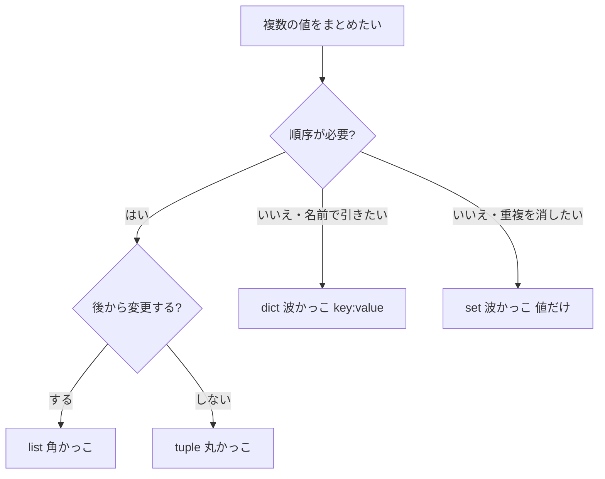

## このセクションで学ぶこと

- 辞書はキーと値のペアでデータを管理する仕組みであることを理解する
- キーを使って値を取り出し・追加・更新できる
- 集合は重複しない要素の集まりであり、list/tuple/dict との違いを説明できる

## 辞書 ― 名前で値を引く

リストは「順番(番号)」で値を取り出しましたが、実務では「名前で値を引きたい」場面が多くあります。たとえばユーザー情報を「`name` は田中、`age` は30」のように扱いたいときです。これに使うのが **辞書(dict)** です。波かっこ `{}` の中に `キー: 値` のペアを並べます。

```python
user = {"name": "田中", "age": 30, "active": True}
print(user["name"])   # 田中 (キーで値を取り出す)
```

値の取り出しはインデックス番号ではなく **キー** で行います。キーは重複できず、文字列を使うのが一般的です。存在しないキーを `user["unknown"]` と指定すると `KeyError` になるため、安全に取り出したいときは `user.get("unknown")`(無ければ `None` を返す)を使います。

## 辞書の追加・更新・走査

辞書はキーを指定して値を追加・更新できます。同じキーに代入すると上書き、新しいキーなら追加です。

```python
user["age"] = 31          # 既存キーを更新
user["email"] = "a@x.jp"  # 新しいキーを追加
for key, value in user.items():
    print(key, value)      # キーと値を順に取り出す
```

`items()` を使うと、キーと値をペアで取り出しながら全体を走査できます。「設定項目」「集計のラベルと件数」など、名前付きでデータを管理したいときに辞書は強力です。

## 集合 ― 重複しない集まり

**集合(set)** は、重複を持たない・順序を持たない要素の集まりです。辞書と同じ波かっこ `{}` で書きますが、`キー: 値` ではなく値だけを並べます。リストから重複を取り除きたいときや、「含まれているか」を高速に判定したいときに使います。

```python
tags = {"python", "web", "python"}
print(tags)              # {'python', 'web'} (重複は自動で消える)
print("web" in tags)     # True (所属判定)
```

## 4 つのデータ構造の使い分け

ここまでの list / tuple / dict / set を整理します。



迷ったら「順序で扱うか/名前で引くか」「変更するか/重複を消したいか」で選びます。日常的に最も使うのは list と dict です。

## まとめ

- 辞書は `{キー: 値}` でデータを管理し、キーで値を出し入れする。`get()` で安全に取り出せる。
- 集合は重複しない順序のない集まりで、重複除去や所属判定(`in`)に向く。
- list/tuple/dict/set は「順序・変更・名前引き・重複」の観点で使い分ける。
