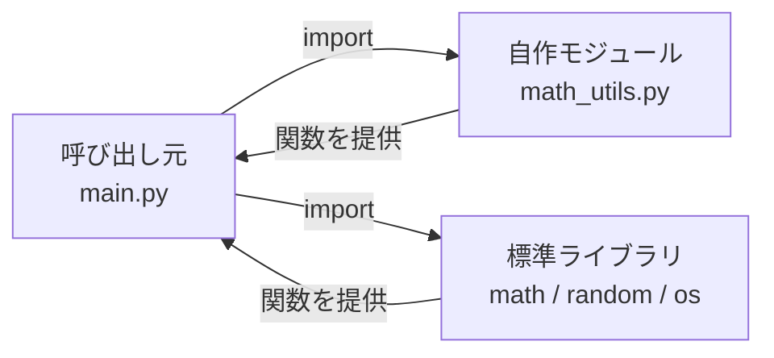

## このセクションで学ぶこと

- import でモジュールを読み込み、その機能を使えるようになる
- 標準ライブラリにどんな便利な機能があるか把握する
- import の書き方(import / from import / as)を使い分けられる

## モジュールとは ― 機能をまとめた部品箱

前のセクションまでで、処理を関数という部品にまとめる方法を学びました。プログラムが大きくなると、今度は「関数や変数のまとまりを、ファイル単位で分けて整理したい」という欲求が出てきます。このとき登場するのが **モジュール** です。

モジュールとは、**関数や変数などをまとめた Python ファイル**のことです。たとえば `math_utils.py` というファイルに計算用の関数を集めておけば、それは `math_utils` という名前のモジュールになります。別のファイルからそのモジュールを **import(読み込み)** すれば、中の関数をそのまま使い回せます。関数が「処理の部品」なら、モジュールは「部品をまとめた箱」だと考えてください。

複数のモジュールをフォルダ単位でまとめたものを **パッケージ** と呼びます。規模が大きくなるほど、モジュールやパッケージに分割して整理することが重要になります。

## import の基本 ― 標準ライブラリを使ってみる

Python には、最初から大量のモジュールが付属しています。これを **標準ライブラリ** と呼びます。追加インストールなしで使えるのが特徴で、`import モジュール名` と書くだけで読み込めます。

```python
import math          # 数学関連のモジュールを読み込む

print(math.sqrt(16))   # 4.0(平方根)
print(math.pi)         # 3.141592653589793
```

`import math` で `math` モジュールを読み込み、`math.sqrt(...)` のように **モジュール名.機能名** の形で呼び出します。前に付く `math.` は「math モジュールの中の sqrt を使う」という意味です。この書き方なら、自分のコードに同じ名前の関数があっても衝突しません。

標準ライブラリには、ほかにも実務でよく使うモジュールが揃っています。

- `random` ― 乱数の生成
- `datetime` ― 日付・時刻の扱い
- `os` ― ファイルパスや環境変数などの OS 機能
- `json` ― JSON 形式の読み書き

```python
import random

print(random.randint(1, 6))   # 1〜6 のサイコロ
```

## import の書き方を使い分ける

import にはいくつかの書き方があり、状況に応じて使い分けます。よく使う関数だけを直接取り込みたいときは `from モジュール名 import 機能名` を使います。

```python
from math import sqrt, pi

print(sqrt(16))   # math. を付けずに直接呼べる
print(pi)
```

この書き方だと `math.` を毎回書かずに済みます。ただし、どのモジュール由来かが分かりにくくなるため、取り込む数は絞るのがコツです。

モジュール名が長いときは `as` で別名(エイリアス)を付けられます。データ分析でよく使う書き方です。

```python
import datetime as dt

now = dt.datetime.now()
print(now)
```

呼び出し元・モジュール・標準ライブラリの関係を図にすると次のようになります。



## 注意点 ― 名前の衝突と import の置き場所

import で注意したいのが **名前の衝突** です。`from math import sqrt` のように直接取り込むと、自分が定義した `sqrt` という関数や変数を上書きしてしまうことがあります。どこの機能か曖昧になりやすい場面では、`import math` として `math.sqrt` の形で呼ぶほうが安全です。

また、`import` 文は **ファイルの先頭にまとめて書く** のが Python の慣習です。関数の中で import することも文法上は可能ですが、どのモジュールに依存しているかが分かりにくくなるため、特別な理由がない限り先頭に置きましょう。標準ライブラリを使いこなせるようになると、車輪の再発明をせずに済み、コードがぐっと短く読みやすくなります。

## まとめ

- モジュールは関数や変数をまとめた部品箱で、`import` で読み込んで再利用する。
- 標準ライブラリは追加インストール不要で使え、`math` / `random` / `datetime` などが揃う。
- `import` / `from import` / `as` を使い分け、import 文はファイル先頭にまとめる。
