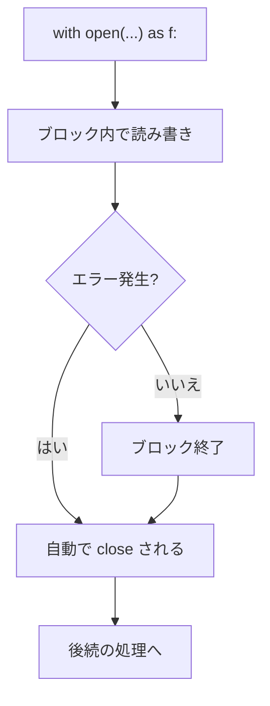

## このセクションで学ぶこと

- `close()` を忘れると起きる問題を理解する
- `with` 文でブロックを抜けると自動でファイルが閉じることを理解する
- `with open(...) as f` の基本形でファイルを安全に読み書きできる

## close() を忘れると何が困るか

前のセクションでは `open()` で開いたファイルを最後に `close()` で閉じました。しかしこの方法には落とし穴があります。**途中でエラーが起きると `close()` まで到達しない** ことがあるのです。

```python
f = open("data.txt", "w", encoding="utf-8")
process(f)        # ここでエラーが起きると...
f.close()         # この行が実行されない
```

`close()` されないファイルは、書き込み内容がディスクに確定しなかったり、OS が握っているファイルの「枠」が解放されないまま残ったりします。短いスクリプトでは表面化しにくいものの、長く動くプログラムでは資源が少しずつ漏れて不具合の原因になります。

## with 文 ― 後始末を自動化する

この問題を解決するのが `with` 文です。`with open(...) as f:` と書くと、`with` のブロックを抜けた瞬間に **自動でファイルが閉じられます**。途中でエラーが起きてブロックを抜ける場合でも、確実に `close()` 相当の処理が走ります。

```python
with open("memo.txt", "r", encoding="utf-8") as f:
    for line in f:
        print(line.rstrip())
# ここに来た時点で f は自動的に閉じられている
```

`open()` が返すファイルオブジェクトは **コンテキストマネージャ** と呼ばれ、「開始時にすること」と「終了時にすること(ここでは閉じる)」をあらかじめ知っています。`with` 文はその終了処理を、ブロックを抜けるタイミングで必ず呼んでくれる仕組みです。



## 書き込みでも同じ

書き込みでも使い方は同じです。`close()` を自分で書く必要がなくなるため、コードが短く、閉じ忘れの心配もなくなります。

```python
with open("log.txt", "w", encoding="utf-8") as f:
    f.write("処理を開始しました\n")
    f.write("処理が完了しました\n")
# ブロックを抜けると書き込みが確定し、ファイルは閉じられる
```

## 注意点

- ファイルが閉じられるのは **`with` のブロックを抜けたとき** です。ブロックの外で `f` を使って読み書きしようとするとエラーになります。
- `with` 文はファイル以外にも使えます。後で学ぶデータベース接続やロックなど、「開いたら必ず閉じたい」対象の多くがコンテキストマネージャに対応しています。
- 複数のファイルを同時に開きたいときは、`with open(a) as f1, open(b) as f2:` のようにカンマで並べられます。

実務では、ファイル操作はほぼ常に `with` 文で書くと考えてかまいません。手動の `close()` よりも安全で読みやすいためです。

## まとめ

- 手動の `close()` は、途中のエラーで実行されないと資源が漏れる危険がある。
- `with open(...) as f:` はブロックを抜けるとき自動でファイルを閉じてくれる。
- 実務ではファイル操作は `with` 文で書くのが基本。
