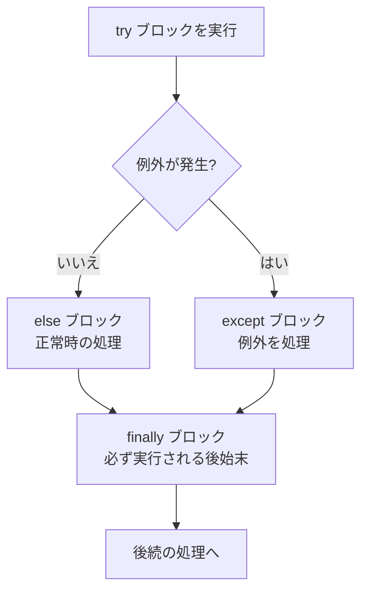

## このセクションで学ぶこと

- 例外とは何か、エラーで処理が止まる仕組みを理解する
- `try` / `except` で例外を捕捉して処理を続けられる
- `except` で例外の種類を指定し、`else` / `finally` の役割を理解する

## 例外とは ― 異常事態を伝える仕組み

プログラムを動かすと、存在しないファイルを開こうとしたり、数値でない文字列を数値に変換しようとしたり、ゼロで割ったりと、想定外の事態が起こります。Python はこうした異常事態を **例外(exception)** という形で知らせます。

例外が起きると、その時点で処理は中断され、何も対処しなければプログラムは **エラーメッセージを出して停止** します。

```python
n = int("abc")   # 数値にできず ValueError が発生
print("ここは実行されない")
```

このように例外を放置するとプログラムが止まってしまいます。そこで「起きるかもしれない処理」を見張り、例外が起きても止まらず対処するための構文が `try` / `except` です。

## try / except で捕まえる

`try:` ブロックに「失敗するかもしれない処理」を書き、`except:` ブロックに「失敗したときにすること」を書きます。`try` の中で例外が起きると、すぐ `except` に飛んで処理を続行できます。

```python
try:
    n = int(input("数値を入力してください: "))
    print(f"2 倍は {n * 2} です")
except ValueError:
    print("数値ではありません。やり直してください。")
```

`except ValueError` のように **例外の種類を指定** すると、その種類だけを捕まえられます。種類を指定せずすべてを捕まえることもできますが、想定した例外だけを捕まえるほうが、思わぬバグを見逃さずに済みます。

## 正常系・異常系・後始末の流れ

`try` / `except` には `else`(例外が起きなかったときだけ実行)と `finally`(起きても起きなくても必ず実行)を加えられます。`finally` は後始末に向いています。全体の流れを図にすると次のようになります。



```python
try:
    f = open("data.txt", "r", encoding="utf-8")
    text = f.read()
except FileNotFoundError:
    print("ファイルが見つかりません")
else:
    print(f"{len(text)} 文字読み込みました")  # 例外がなかったときだけ
finally:
    print("処理を終了します")  # どちらの場合も必ず実行
```

## 注意点

- `except Exception:` で何でも捕まえると、本来気づくべきバグまで握りつぶしてしまいます。捕まえる例外は具体的な種類に絞るのが原則です。
- 複数の種類に対応したいときは `except (ValueError, TypeError):` とまとめたり、`except` を複数並べたりできます。
- `as e` を付けると `except ValueError as e:` のように例外オブジェクトを受け取れ、`print(e)` で内容を確認できます。

## まとめ

- 例外は実行中の異常事態を伝える仕組みで、放置するとプログラムが止まる。
- `try` で失敗しうる処理を囲み、`except` で種類を指定して対処する。
- `else` は正常時だけ、`finally` は必ず実行され、後始末に使う。
