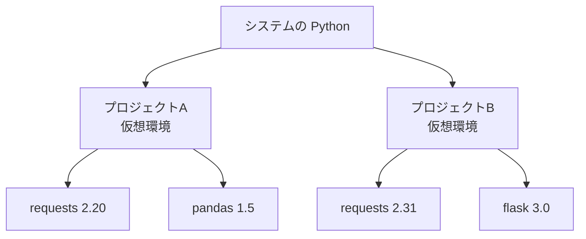

## このセクションで学ぶこと

- 仮想環境がなぜ必要かを説明できる
- venv で仮想環境を作成・有効化できる
- プロジェクトごとに依存を分離する構成を理解する

## なぜ仮想環境が必要か

前のセクションで見たとおり、pip は何もしないと Python 環境全体にパッケージを入れます。ここで問題が起きます。プロジェクト A は `requests` の古いバージョン、プロジェクト B は新しいバージョンを必要とする、といった場合、一つの環境にまとめて入れるとバージョンが衝突してどちらかが壊れてしまいます。

これを解決するのが **仮想環境** です。仮想環境は、プロジェクトごとに独立した Python とパッケージのセットを持てる隔離された箱のようなものです。プロジェクトごとに箱を分けておけば、互いのライブラリが干渉しません。



この図のように、各プロジェクトが自分専用の仮想環境を持ち、その中にだけ必要なパッケージを入れます。プロジェクト A の `requests 2.20` とプロジェクト B の `requests 2.31` は別々の箱にあるので、衝突しません。

## venv で仮想環境を作る

Python には **venv** という仮想環境作成ツールが標準で付属しています。追加導入は不要です。プロジェクトのフォルダで次を実行します。

```bash
python -m venv .venv
```

これで `.venv` というフォルダが作られ、その中に隔離された Python 環境が用意されます。フォルダ名は慣習的に `.venv` がよく使われます。

## アクティベートして使う

作っただけでは有効になりません。**アクティベート**(有効化)が必要です。OS によってコマンドが異なります。

```bash
# macOS / Linux
source .venv/bin/activate

# Windows (PowerShell)
.venv\Scripts\Activate.ps1
```

有効化するとプロンプトの先頭に `(.venv)` と表示され、以後の `python` や `pip` はこの仮想環境を指します。この状態で `pip install` すれば、パッケージは仮想環境の中だけに入ります。作業を終えるときは `deactivate` で元に戻せます。

## 注意点:.venv はコミットしない

`.venv` フォルダは環境ごとに作り直すもので、サイズも大きいため、Git などのバージョン管理には含めません。`.gitignore` に `.venv/` を追加しておきましょう。代わりに「どのパッケージが必要か」を記録して共有する方法を、次のセクションで学びます。

## まとめ

- 仮想環境はプロジェクトごとに依存を分離し、バージョン衝突を防ぐ。
- `python -m venv .venv` で作成し、アクティベートして使う。
- `.venv` 自体は共有せず、`.gitignore` に入れる。
