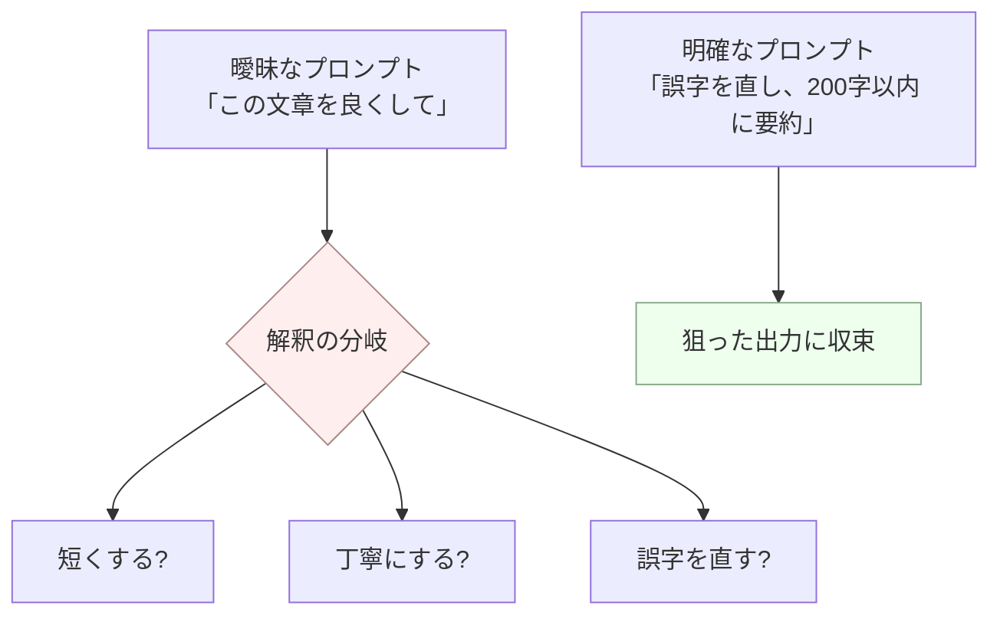

## このセクションで学ぶこと

- 曖昧なプロンプトは分布を絞れず、出力がぶれる原因になることを理解する
- モデルは「行間を察する」のではなく、不足を確率的に埋めているだけだと捉える
- 曖昧さを減らす = 分布を絞り込む、という視点で良いプロンプトを評価できる

## 曖昧さは分布を広げる

前のセクションで、プロンプトは次トークンの確率分布を条件づけると学びました。ここから自然に導けるのが、**曖昧なプロンプトほど分布が広がり、出力がぶれる**という事実です。

たとえば「この文章を良くして」というプロンプトを考えてみます。「良く」とは、誤字脱字の修正でしょうか、丁寧な文体への変換でしょうか、短くまとめることでしょうか。指定がないぶん、モデルにとってどれも「ありえそう」になり、分布が複数の方向に分散します。結果として、実行のたびに違う方向の修正が返ってきたり、こちらの意図と噛み合わない出力になったりします。曖昧さは「敵」だと言われるのは、それが分布を絞れないまま運任せにしてしまうからです。

## モデルは察してくれない、確率で埋めるだけ

ここで誤解してはいけないのは、**モデルは人間の同僚のように「行間を察して」くれるわけではない**という点です。指定されていない項目について、モデルは気を利かせているのではなく、学習データから見て「もっともありそうな」デフォルト解釈で確率的に埋めているだけです。

「報告書を書いて」とだけ言えば、モデルは適当な長さ・形式・トーンを勝手に選びます。それが偶然こちらの期待と一致することもありますが、保証はありません。**人間相手なら通じる省略が、モデル相手では通じにくい**——この前提に立つことが、プロンプト設計の出発点になります。

## 曖昧さを減らすとは「分布を絞る」こと

良いプロンプトとは、結局のところ**モデルが取りうる解釈の幅を狭め、分布を狙った一点に寄せるプロンプト**です。具体的には、目的(何のために)・対象読者・形式・長さ・トーン・含めること/含めないことを言葉にするほど、曖昧さは減っていきます。先ほどの「この文章を良くして」も、「誤字を直し、敬体に統一し、200 字以内に要約してください」と書き換えるだけで、モデルが選ぶべき方向は一気に定まります。曖昧な動詞(「良くする」「整える」「いい感じに」)を、観察可能な具体的指示に置き換えるのが第一歩です。

ただし注意点として、**何でもかんでも細かく指定すればよいわけではありません**。本当に出力を左右する条件だけを絞って明示し、どうでもよい部分はモデルに任せるのが実務的です。過剰な指示はかえって指示同士が矛盾し、別の混乱を生みます(これは第6章のアンチパターンで詳しく扱います)。ここでは「曖昧さは分布を広げ、明確さは分布を絞る」という軸を持ち帰ってください。

## まとめ

- 曖昧なプロンプトは分布を絞れず、出力が実行ごとにぶれる原因になる。
- モデルは行間を察するのではなく、不足分を確率的なデフォルト解釈で埋めているだけ。
- 良いプロンプトは「出力を左右する条件」を明示して分布を狙った一点に寄せる。
