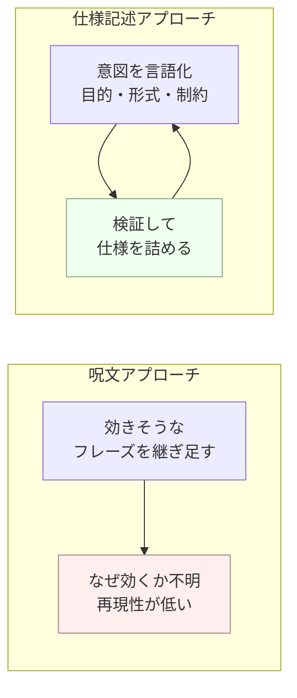

## このセクションで学ぶこと

- プロンプトエンジニアリングを「仕様記述」として捉える視点を持つ
- 「呪文」を集める発想の限界を理解し、再現性のある設計に切り替える
- 単発のテクニックより「意図を言語化して検証する」プロセスが本質だと分かる

## 「効く呪文」を探す発想の限界

プロンプトエンジニアリングというと、「これを書けば賢くなる魔法のフレーズ」を集める作業だと思われがちです。SNS では「この一言を足すだけで精度が劇的に上がる」といった投稿が流れてきます。確かに効く場面もありますが、この発想には大きな限界があります。

第一に、**なぜ効くのかを理解していないと再現できません**。たまたまうまくいったフレーズが、別のタスクやモデルのバージョン違いでは効かないことは珍しくありません。第二に、呪文を継ぎ足していくと、指示同士が衝突して逆に出力が崩れます。「呪文信仰」——唱えれば必ず効くという思い込み——は、運任せのプロンプトから抜け出せなくする落とし穴です。

## プロンプトは「仕様記述」である

ではプロンプトエンジニアリングの本質は何か。本書の立場は明確で、**それは仕様記述(spec)である**ということです。ソフトウェアの仕様書が「何を・どんな入力で・どんな出力形式で・どんな制約のもとで作るか」を定義するのと同じように、プロンプトは**モデルに対する仕様書**です。

第1セクションの言葉に戻せば、仕様を明確に書くほど分布が絞られ、第2セクションの言葉では、曖昧さが減って出力が安定します。つまり「呪文を足す」のではなく「仕様を詰める」。これがプロンプト改善の正しい方向です。

## 本質はプロセスにある

具体例で考えましょう。「議事録から要約を作る」プロンプトを改善するとき、呪文アプローチなら「もっと賢く要約して」と書き換えます。仕様記述アプローチなら、「誰向けか」「何文字か」「決定事項とToDoを分けるか」を仕様として書き下し、出力を見て足りない条件を足していきます。後者は遅く見えて、再利用でき、改善の因果がたどれます。

この違いは、書いた本人だけでなくチームにも効いてきます。呪文として渡されたプロンプトは、受け取った人が「どこをどう直せば改善するのか」を判断できません。一方で仕様として書かれたプロンプトは、「対象読者を変えたい」「ToDo は不要だ」といった要望をそのまま仕様の一行として足し引きできます。再現でき、共有でき、改善の根拠が残る——これが仕様記述アプローチの実務的な価値です。

注意点として、仕様記述といっても最初から完璧な仕様は書けません。**出力を観察し、ずれた部分を仕様に反映する反復こそが本体**です(これは第5章で詳しく扱います)。プロンプトエンジニアリングは一発で当てる才能ではなく、意図を言語化して検証するプロセスだと押さえてください。

## まとめ

- 「効く呪文」を集める発想は再現性を欠き、指示の衝突も招きやすい。
- プロンプトはモデルへの仕様記述であり、目的・形式・制約を言葉で定義する作業。
- 本質は一発の妙案ではなく、出力を観察して仕様を詰める反復プロセスにある。
