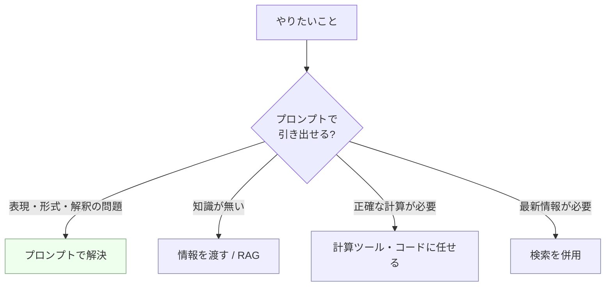

## このセクションで学ぶこと

- プロンプトで解けるのは「表現や引き出し方の問題」であり、知識そのものは増やせないと理解する
- 知識不足・計算・最新情報という 3 つの典型的なギャップを区別できる
- ギャップを埋める手段(RAG / ツール / 検索)はプロンプトの外側にあると捉える

## プロンプトは「引き出し方」を変えるだけ

ここまで、プロンプトは分布を条件づけ、曖昧さを減らし、仕様として書くものだと見てきました。ただし強力に見えるこの道具には、はっきりとした境界線があります。**プロンプトが動かせるのは、モデルが持っている能力や知識の「引き出し方」であって、持っていないものを足すことはできない**——これが本章の最後の土台です。

言い換えると、プロンプトで条件づけても、分布のなかに正しい答えが十分な確率で存在していなければ、それを引き当てることはできません。存在しないものをいくら丁寧に指示しても、モデルはもっともらしい嘘(ハルシネーション)を返すか、当てずっぽうを返すだけです。プロンプトを磨く前に、「これはそもそもプロンプトで解ける問題か?」を見極める目が必要です。

## プロンプトで埋まらない 3 つのギャップ

実務でつまずきやすいギャップは、大きく 3 つに分けられます。

- **知識のギャップ**: モデルが学習していない社内規程・自社製品の仕様・ニッチな専門知識は、どう聞いても正確には出てきません。プロンプトに情報を**含めれば**答えられますが、含めずに「知っているはず」と期待するのは誤りです。
- **計算・厳密処理のギャップ**: 桁の多い掛け算、正確なソート、長文の厳密な文字数カウントなどは、確率的に「それっぽい」答えを出すのが得意なモデルの苦手分野です。たまたま合うこともありますが、保証はありません。
- **最新情報のギャップ**: モデルには学習データの締め切り(知識のカットオフ)があり、それ以降の出来事は知りません。「昨日のニュース」「今日の為替」はプロンプトだけでは埋まりません。

## ギャップは「外側の仕組み」で埋める

では、これらは解けないのかというと、そうではありません。**プロンプトの外側に仕組みを足せば**埋められます。知識のギャップは、必要な資料をプロンプトに添える、あるいは検索して取得した情報を渡す RAG(Retrieval-Augmented Generation)で補えます。計算は計算ツールやコード実行に任せ、最新情報は検索を併用します。これらはいずれもプロンプト単体の技ではなく、プロンプトと外部の道具を組み合わせる設計です(第6章でアプリ・エージェントへの接続として扱います)。

注意点として、初学者が陥りやすいのは「うまく聞けば何でも答えてくれるはず」という過信です。境界を知っていれば、「これはプロンプトの磨き込みで解く問題」「これは情報を渡さないと無理な問題」を切り分けられます。**プロンプトエンジニアリングの上達とは、解ける問題を上手に解くことと同じくらい、解けない問題に時間を溶かさないこと**でもあります。

## まとめ

- プロンプトは知識や能力の引き出し方を変えるだけで、持っていないものは足せない。
- 知識・計算・最新情報の 3 つは、プロンプト単体では埋まらない典型的なギャップ。
- これらは RAG・ツール・検索などプロンプトの外側の仕組みで補う——境界を知ることが上達の一部。
