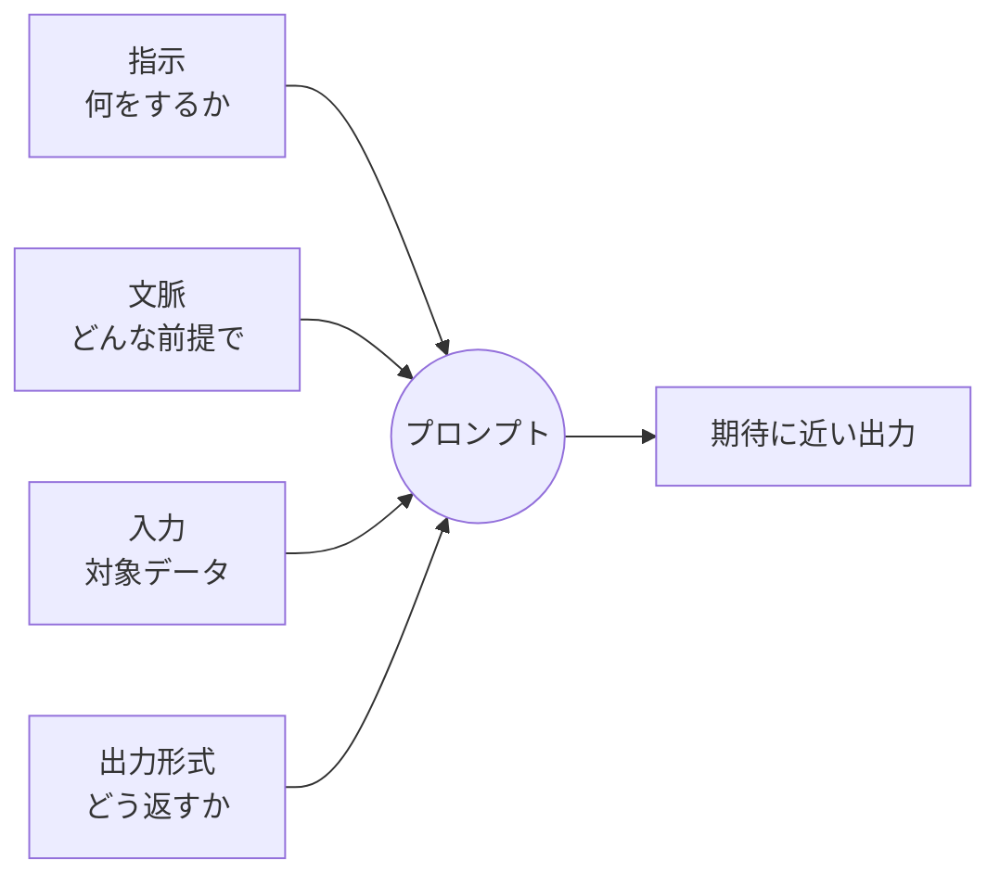

## このセクションで学ぶこと

- プロンプトを「指示・文脈・入力・出力形式」の4要素に分解して捉えること
- 一文の丸投げを4要素に整理すると、なぜ曖昧さが減るのか
- 4要素は全部そろえる必要はなく、タスクに応じて選ぶものであること

## プロンプトは4つの部品の組み合わせ

第01章で、プロンプトとは出力の確率分布を絞り込む「仕様記述」だと整理しました。では実際にどう書けば絞り込めるのか。その第一歩が **プロンプトを4つの部品に分解して設計する** ことです。多くの実用的なプロンプトは、次の4要素の組み合わせで説明できます。

- **指示(Instruction)**: 何をしてほしいか。タスクそのもの。
- **文脈(Context)**: どんな前提・背景でやってほしいか。読み手や目的。
- **入力(Input data)**: 処理する対象データ。本文や表など。
- **出力形式(Output format)**: 結果をどんな形で返してほしいか。

漠然と「いいプロンプトを書こう」と考えると手が止まりますが、「この4つの欄を埋める」と考えると、何が足りないかが見えてきます。



## 丸投げを4要素に整理してみる

たとえば次のような一文の依頼は、よくある「丸投げプロンプト」です。

```text
この記事をまとめて。
```

モデルから見ると、何文字で・誰向けに・どんな形でまとめればよいかがまったく分かりません。残った曖昧さはモデルが勝手に埋めるので、結果は毎回ぶれます。これを4要素に整理すると、こうなります。

```text
# 指示
次の記事を要約してください。

# 文脈
読み手は、この分野の予備知識がない新入社員です。専門用語は避けてください。

# 入力
---
（ここに記事本文を貼る）
---

# 出力形式
- 箇条書きで3点
- 各点は40字以内
- 結論を最初の1点に置く
```

同じ「まとめて」でも、こちらは出力の幅がぐっと狭まります。やっているのは魔法ではなく、**モデルが推測で埋めていた欄を、こちらが明示的に埋めただけ** です。曖昧さを減らすとは、こういう地道な穴埋め作業のことです。

## 4要素は「全部そろえる」ものではない

注意したいのは、4要素を毎回フルセットで書く必要はない点です。雑談や軽い相談では指示だけで十分ですし、入力データのないアイデア出しでは「入力」の欄は空になります。**タスクに必要な欄だけを埋め、不要な欄は省く** のが実務的です。

逆に、出力がぶれて困っているときは「どの欄が抜けているか」を疑うのが有効です。要約の長さがバラつくなら出力形式が、的外れな観点で要約されるなら文脈が抜けている、という具合に切り分けられます。4要素は、書くためのテンプレートであると同時に、**直すときの点検リスト** でもあるのです。

## まとめ

- プロンプトは「指示・文脈・入力・出力形式」の4要素に分解して設計できる。
- 丸投げを4要素に整理する作業は、モデルが推測で埋めていた欄を明示する作業そのもの。
- 4要素は全部そろえるものではなく、タスクに応じて取捨選択し、不調時の点検リストとしても使う。
