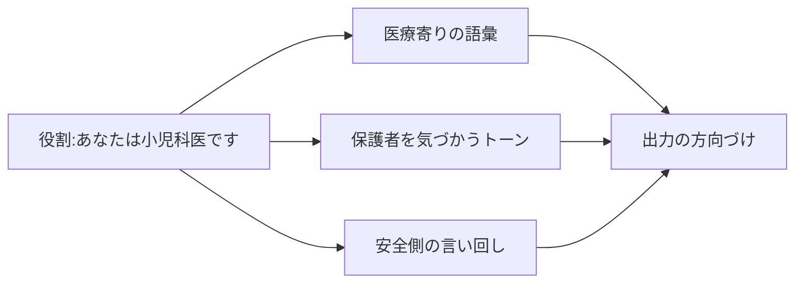

## このセクションで学ぶこと

- 役割付与がなぜ出力を変えるのか、その正体
- システムプロンプトとユーザープロンプトの役割分担
- 役割付与が効く場面と、効かない・期待しすぎてはいけない限界

## 「あなたは〇〇です」は文脈の圧縮指定

「あなたは経験豊富な小児科医です」「あなたはぶっきらぼうな下町の職人です」——こうした役割付与は、プロンプトの定番テクニックです。なぜ効くのかというと、第01章で見たとおり、モデルは文脈に合う言葉を確率的に選ぶからです。「小児科医」という設定は、医療寄りの語彙・保護者を気づかうトーン・安全側に倒した言い回しといった膨大な前提を、**たった一語で呼び出すスイッチ** として働きます。

つまり役割付与は、本来なら長々と書くべき文脈(誰として・どんなトーンで・何を重視して答えるか)を、**短い肩書きに圧縮した指定** だと捉えると理解しやすいです。前のセクションの4要素でいえば、役割は「文脈」を効率よく与える手段にあたります。



## システムプロンプトとユーザープロンプト

多くの LLM では、会話全体に効く **システムプロンプト** と、個別の依頼を書く **ユーザープロンプト** が分かれています。役割やトーン、守ってほしい方針のように「会話を通じてずっと保ってほしい設定」はシステムプロンプトに、「この記事を要約して」のような個別タスクはユーザープロンプトに置くのが基本です。

```text
[システムプロンプト]
あなたはセキュリティに詳しいコードレビュアーです。
指摘は重大度の高い順に並べ、断定を避けて根拠を添えてください。

[ユーザープロンプト]
次のコードをレビューしてください。
（コードを貼る）
```

システムプロンプトはユーザープロンプトより優先度が高く扱われるため、毎回書き直したくない前提はここに固定しておくと、会話全体の振る舞いが安定します。

## 効くこと・効かないことを切り分ける

役割付与には明確な限界があります。効くのは主に **トーン・観点・語彙・出力の寄せ方** であって、モデルが持っていない知識や正確さを生み出すわけではありません。「あなたは世界一の数学者です」と書いても計算間違いは消えませんし、「あなたは最新情報に通じた専門家です」と宣言しても学習時点以降の事実は出てきません。これは第01章の「解けない問題」の話と地続きです。

つまり役割は **出力の色を変える調味料** であって、中身の素材そのものを足すものではない、と考えるのが安全です。専門性が必要なら、役割を名乗らせるより、必要な事実を文脈として与えるほうが確実です。また、奇抜なペルソナを盛りすぎると本来のタスクがぼやけることもあるため、目的に必要な範囲にとどめるのがコツです。

## まとめ

- 役割付与は、長い文脈を短い肩書きに圧縮してトーンや観点を寄せるスイッチである。
- 会話全体に効く設定はシステムプロンプトに、個別タスクはユーザープロンプトに置く。
- 役割で変えられるのは出力の色であり、知識や正確さは底上げできない。中身が要るなら事実を文脈で与える。
