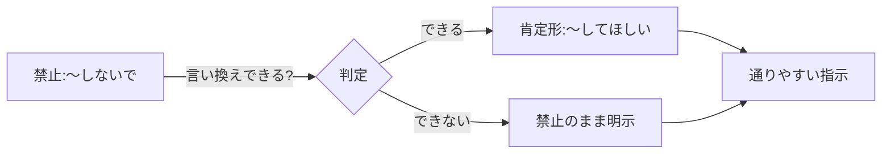

## このセクションで学ぶこと

- 制約と禁止を明示すると、なぜ出力が安定するのか
- 「やらないで」より「こうして」のほうが効きやすい場面の見分け方
- 制約を盛りすぎたときに起きる矛盾と、その避け方

## 「やらないこと」を書くと出力が締まる

ここまでの3つのセクションでは、指示・文脈・入力・出力形式を分解し、役割で文脈を圧縮し、デリミタで境界を引いてきました。最後の仕上げが **制約と禁止** です。これは「許される出力の範囲」を外側から絞り込む作業にあたります。

第01章で見たとおり、プロンプトは出力の確率分布を絞り込む行為でした。制約と禁止は、その分布から「望ましくない領域」を削り落とす指定です。たとえば次のように書きます。

```text
# 指示
新サービスの紹介文を書いてください。

# 制約
- 200字以内
- 専門用語を使う場合は必ず一言で補足する

# 禁止事項
- 誇大表現(「業界No.1」「絶対に」など)を使わない
- 価格には触れない
```

「何をするか」だけでなく「何をしないか」を書いておくと、モデルが暴走しやすい方向にあらかじめ蓋ができます。誇大表現や脱線、余計な前置きといった「ありがちな逸脱」は、禁止として先回りで潰しておくのが有効です。

## 否定形より肯定形が効きやすいことがある

ただし、禁止には落とし穴があります。「ピンクの象を想像しないでください」と言われると、かえって象が浮かぶように、**否定形は禁止対象そのものに注意を向けてしまう** ことがあります。モデルでも同様で、「謝らないで」と書くと逆に謝罪の言葉が増えることすらあります。

そこで有効なのが、**禁止したい振る舞いを、してほしい行動に言い換える** ことです。

```text
（効きにくい）前置きや謝罪を書かないでください。
（効きやすい）最初の一文から結論を書いてください。

（効きにくい）専門用語を使わないでください。
（効きやすい）中学生にも伝わる平易な言葉で書いてください。
```

「やらないこと」を裏返して「やること」に変換できないか、を一度考える習慣をつけると、指示が通りやすくなります。肯定形は、モデルに「目指すべきゴール」を直接示すため、禁止のように「避けるべき対象」を意識させずに済むのが利点です。もちろん、誇大表現の禁止のように肯定形に言い換えにくいものもあるので、その場合は禁止として明示したうえで、禁止対象の具体例を1〜2個添えると、何を避ければよいかが伝わりやすくなります。両者を場面に応じて使い分けるのが現実的です。



## 制約は盛りすぎると壊れる

注意したいのは、制約や禁止を増やせば増やすほど出力が良くなるわけではない点です。条件が多すぎると、モデルはすべてを同時には満たせず、どれかを取りこぼします。さらに「200字以内」と「詳しく説明して」のように **互いに矛盾する制約** を並べると、出力は不安定になり、毎回違う妥協のしかたをします。

対策はふたつです。ひとつは **本当に外せない制約だけに絞る** こと。あれもこれもと禁止を足す前に、それが守られなかったとき実際に困るかを自問します。もうひとつは **優先順位を明示する** ことで、「字数を守れない場合は字数を優先し、内容を削ってください」のように、衝突したときの判断基準を添えておくと破綻しにくくなります。制約は多さではなく、効く一手を厳選して書くものだと覚えておきましょう。

## まとめ

- 制約と禁止は、望ましくない出力領域を削り落として出力を締める指定である。
- 否定形は禁止対象に注意を向けてしまうため、「やること」に言い換えると通りやすい。
- 制約は盛りすぎると矛盾・取りこぼしを招く。外せない条件に絞り、衝突時の優先順位を添える。
