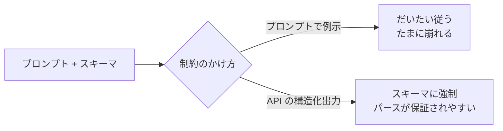

## このセクションで学ぶこと

- スキーマを与えると出力の形が固定され、後工程の解析が安定することを理解する
- 例示(サンプル JSON)とキーの型・必須/任意の明示が効くことを知る
- API の構造化出力モードと、プロンプトだけで縛る方法の違いを区別できる

## 「JSON で」だけでは足りない

前のセクションで「JSON で出力して」と頼む方法を見ました。しかしこれだけだと、キー名がブレたり、ある実行では `price` が `"1000円"` という文字列に、別の実行では `1000` という数値になったりします。プログラムでこれを**パース**して使う段になると、こうした揺れが致命的なバグになります。

そこで使うのが**スキーマ**です。スキーマとは「出力はこういう構造でなければならない」という型の定義です。プロンプトの中でスキーマを具体的に示すと、出力の形が固定され、後工程が安定します。

## スキーマは「サンプル + 型 + 必須/任意」で伝える

プロンプトだけでスキーマを縛るときは、次の3点を書くのが効果的です。

```text
次の JSON 形式で出力してください。コードブロックや説明文は付けず、JSON 本体のみを返してください。

{
  "name": "商品名(文字列・必須)",
  "price": 1000,            // 数値・必須・通貨記号は含めない
  "tags": ["文字列の配列・任意・なければ空配列"]
}
```

ポイントは3つです。第一に、**実際の値が入ったサンプルを1つ見せる**こと。抽象的な説明より、具体例のほうがモデルは正確に真似します。第二に、**型と単位を明示する**こと(「数値・通貨記号は含めない」)。第三に、**必須か任意か、無いときどうするか**を書くこと(「なければ空配列」)。これで欠損による解析エラーを大きく減らせます。

特に効くのが、サンプル値の中にコメントで制約を書き込むやり方です。「ここは数値」「通貨記号は含めない」「なければ空配列」といった注記を値のすぐ横に置くと、説明文を別の場所にまとめて書くより、モデルが各キーの約束を取り違えにくくなります。スキーマは「言葉で長々と説明する」より「埋めるべき器を具体的に見せる」ほうが伝わる、と覚えておくとよいでしょう。

## API の構造化出力モードという強力な手段

主要な LLM API には、**構造化出力モード**(JSON mode / Structured Outputs などと呼ばれる)が用意されています。これは API 呼び出し時にスキーマを渡すと、モデルの出力が**そのスキーマに必ず従う**ことを仕組みとして保証する機能です。



プロンプトでの例示は手軽ですが「だいたい従う」レベルで、たまに崩れます。一方、API の構造化出力モードは仕組みで縛るため、プログラムから安定して使うなら断然こちらが有利です。**人が読む用途ならプロンプト例示で十分、機械で確実に処理するなら API の機能を使う**、と覚えておきましょう。

## 注意点

スキーマを厳しくしすぎると、モデルが**無理に枠へ押し込めて事実を歪める**ことがあります。例えば必須キーに該当する情報が入力に無いとき、それらしい値を捏造することがあります。「該当する情報が無ければ null を入れる」と逃げ道を用意しておくと、嘘の値より扱いやすくなります。

## まとめ

- 「JSON で」だけでは型・キーがブレる。スキーマで構造を固定する。
- サンプル値・型・必須/任意の3点をプロンプトで具体的に示す。
- 機械で確実に処理するなら、API の構造化出力モードが最も安定する。
