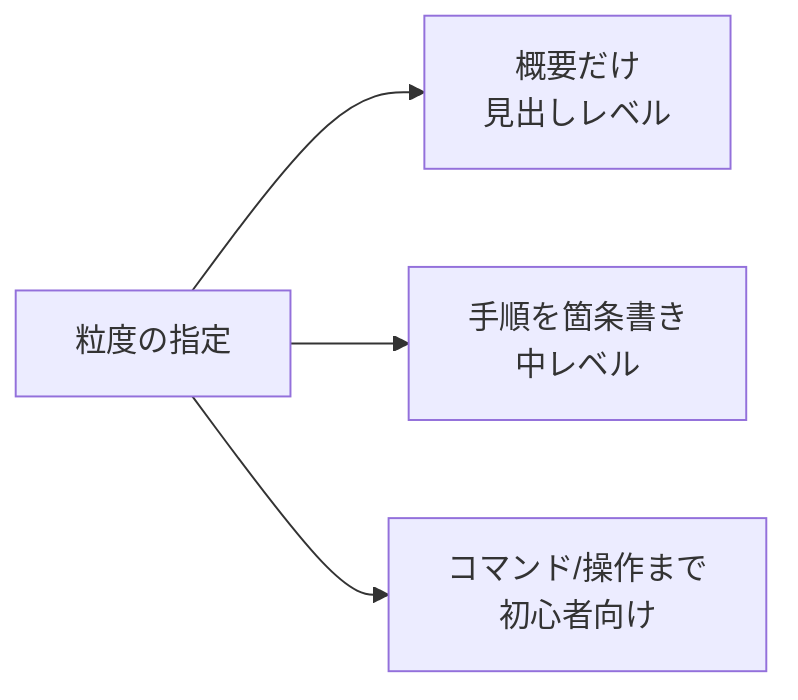

## このセクションで学ぶこと

- トーンは「読み手」と「具体的な形容」で指定すると安定することを理解する
- 長さは文字数より「文の数・段落数・抽象度」で縛るほうが効くことを知る
- 粒度(どこまで細かく言うか)を読み手のレベルで調整できる

## 形式が決まっても、調子と量はまだ自由

前の2セクションで出力の「形」を制御しました。しかし同じ形式でも、フォーマルか砕けているか、長いか短いか、ざっくりか詳しいかはまだ自由なままです。この3つ — **トーン・長さ・粒度** — を揃えると、出力が「ちょうど使える」状態になります。

## トーンは「読み手」を指定するのが一番効く

トーンを「丁寧に」「分かりやすく」と頼んでもブレます。最も効くのは**読み手を具体的に指定する**ことです。「小学生に説明するように」「ITに詳しくない経営層向けに」「同僚エンジニアへの技術メモとして」のように相手を決めると、語彙も例えも一気に揃います。

さらに**具体的な形容**を足すと精度が上がります。

```text
弱い指定:  丁寧な文章で書いてください。
強い指定:  ITに詳しくない経営層向けに、専門用語を避け、
           1文を短く、結論を先に書く敬体で説明してください。
```

第02章で扱った役割付与(ペルソナ)とも相性が良く、「あなたは経験豊富なテクニカルライターです」と組み合わせるとトーンがさらに安定します。

## 長さは「文字数」より「構造」で縛る

「200文字で」と頼んでも、LLM は正確な文字数カウントが苦手で、たいてい外します。長さを制御したいときは、**文字数ではなく構造で縛る**ほうが確実です。

- 「**3文以内**でまとめてください」
- 「各項目は**1行**、**最大5項目**まで」
- 「**段落は2つまで**、1段落目に結論、2段落目に理由」

文・行・段落・項目の**数**は、モデルが守りやすい単位です。なぜ文字数が苦手かというと、モデルは文章を文字単位ではなくトークン(語のかたまり)単位で扱っており、生成しながら正確に字数を数えているわけではないからです。一方で「3文」「2段落」のような構造の単位は、書き進める途中で区切りとして意識しやすく、結果として守られやすくなります。どうしてもボリューム感を伝えたいなら「ツイート1本程度」「メール1通くらい」といった**読み手が知っている尺度**で示すと近づきます。

## 粒度は読み手のレベルで決める

粒度とは「どこまで細かく言うか」です。同じ手順説明でも、初心者には一つひとつのクリックまで、熟練者には要点だけ、と変える必要があります。



粒度はトーンの「読み手指定」とセットで決まります。「初心者向けに、コマンドを省略せず1つずつ」「熟練者向けに、自明な手順は省いて要点だけ」のように、**読み手 + 省略の方針**を書くと意図どおりになります。

## 注意点

3つを一度に欲張ると指示が矛盾しがちです。「詳しく、かつ3文で」は両立しません。**長さと粒度はトレードオフ**だと意識し、優先順位を決めて指定しましょう。迷ったら「読み手」を起点に、その人にとって最適な調子・量・細かさを逆算するのが近道です。

## まとめ

- トーンは「読み手の指定 + 具体的な形容」で安定する。
- 長さは文字数より「文・段落・項目の数」で縛ると守られやすい。
- 粒度は読み手のレベルで決め、長さとのトレードオフに注意する。
