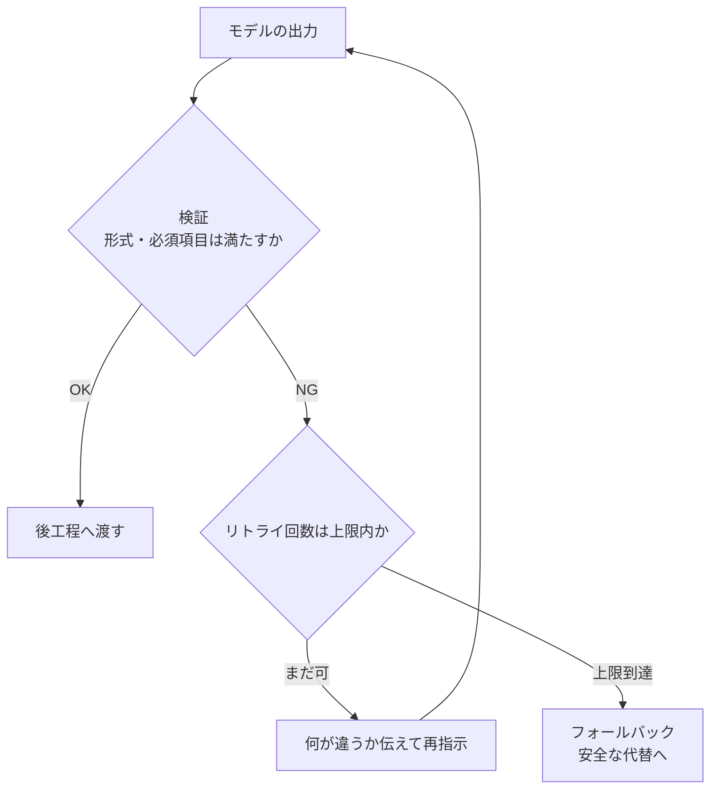

## このセクションで学ぶこと

- 出力は一定の確率で崩れる前提に立ち、検証する仕組みを置くことを理解する
- 崩れたときに「具体的に何が違うか」を伝えて再指示するリトライ設計を組める
- 何度直しても通らない場合に備えたフォールバックの考え方を知る

## 出力は「だいたい従う」もの — 崩れる前提で設計する

ここまでで形式・スキーマ・トーンの指定を見てきました。しかしどれだけ丁寧に指定しても、LLM の出力は確率的なので、**一定の確率で崩れます**。JSON のはずがコードブロックの枕詞が付く、必須キーが欠ける、表の列数がずれる — こうした崩れは、実行回数を重ねれば必ず起きます。

ここで大事なのは、「崩れないプロンプトを目指す」のではなく、**「崩れることを前提に、崩れを検知して立て直す仕組みを置く」**という発想の切り替えです。1回のプロンプトで完璧を狙うのをやめ、出力を受け取る側に**検証 → 再指示 → フォールバック**の3段構えを用意します。



## まず検証する — 信じる前にチェックする

最初の一手は**バリデーション(検証)**です。モデルの出力を後工程へ渡す前に、「期待どおりか」を機械的にチェックします。JSON ならパースが通るか・必須キーが揃っているか・型が合っているか、表なら列数が正しいか、といった具合です。

検証を入れる価値は、**崩れを「静かなバグ」にしないこと**にあります。検証がなければ、欠けたキーや混入した枕詞がそのまま後工程に流れ込み、ずっと先で原因不明のエラーになります。出口で一度せき止めておけば、問題はその場で捕まえられます。

## 再指示する — 「具体的に何が違うか」を返す

検証で弾いたら、次は**再指示(リトライ)**です。ここでよくある失敗が、ただ「もう一度やって」と頼むことです。これでは同じ崩れを繰り返しがちです。効くのは、**何がどう違ったかを具体的に伝えて直させる**ことです。

```text
前回の出力は JSON として解析できませんでした。
問題点:
- 先頭に「以下が結果です」という説明文が付いていた
- price キーが文字列 "1000円" になっていた(数値で、通貨記号なしが正)

説明文を一切付けず、price を数値にして、JSON 本体のみを再出力してください。
```

このようにエラー内容を**フィードバックとして次のプロンプトに差し込む**と、モデルは何を直せばよいかが分かり、成功率が上がります。検証で得られた具体的な失敗理由が、そのまま再指示の材料になるわけです。

## フォールバックを用意する — 諦めどきを決めておく

再指示しても通らないことはあります。リトライを無限に繰り返すと、時間も費用も無駄になります。そこで**リトライ回数に上限**(例: 2〜3回)を設け、それでも駄目なら**フォールバック**に切り替えます。

フォールバックの具体例には、次のようなものがあります。

- **安全な既定値を返す**(例: 空の配列や「該当なし」を返して処理を続ける)
- **人間にエスカレーションする**(自動処理を諦め、担当者に回す)
- **崩れた出力をそのまま記録だけしておき、後で原因を調べる**

要は「最悪のとき、何が起きてほしいか」をあらかじめ決めておくことです。完璧な出力を待ち続けて全体が止まるより、**程よく諦めて安全側に倒す**ほうが、実務のシステムとしては健全です。なお、前のセクションで触れた API の構造化出力モードを使えば形式崩れそのものを大きく減らせるので、検証・再指示の負担も軽くなります。仕組みで防げる崩れは仕組みで防ぎ、それでも残る崩れをこの3段構えで受け止める、という二段構成が現実的です。

## まとめ

- 出力は確率的に崩れる。崩れない前提ではなく、崩れを受け止める設計をする。
- 検証で出口をせき止め、失敗理由を具体的に伝えて再指示すると成功率が上がる。
- リトライ上限とフォールバックを決め、最悪時に安全側へ倒せるようにしておく。
