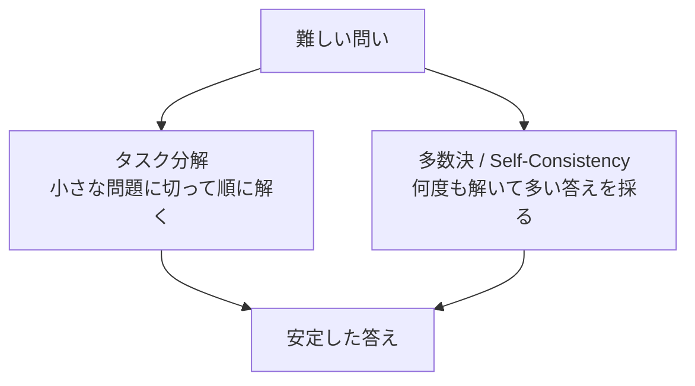

## このセクションで学ぶこと

- 1つのプロンプトに詰め込まず、タスクを小さく分けて順に解かせる発想
- Self-Consistency(複数回解いて多数決を取る)の考え方と向くタスク
- 分解・多数決はコストと引き換えに精度を買う手段だと理解する

## 難しい問いは「分ける」「重ねる」で攻める

前のセクションの Chain-of-Thought でも安定しない難問があります。そういうときに使えるのが、毛色の違う2つの戦略です。1つは問題を小さく分ける **タスク分解**、もう1つは同じ問題を何度も解いて答えを **多数決** で決める Self-Consistency です。どちらも「1回のプロンプトで一発正解を狙う」のをやめる、という共通点があります。



## タスク分解 — 一度に1つのことだけ解かせる

1つのプロンプトに「要約して、要点を抽出して、英訳して」と詰め込むと、モデルはどこかで手を抜いたり混線したりします。これを **タスク分解** で、ステップごとに分けて順に解かせます。

```text
# ステップ1
次の議事録から決定事項だけを箇条書きで抜き出してください。
（議事録本文）

# ステップ2（ステップ1の出力を入力にする）
次の決定事項を、担当者ごとにグループ化してください。
（ステップ1の結果）
```

ポイントは、**前のステップの出力を次のステップの入力にする** ことです。各ステップが単純になるぶん、モデルが間違えにくくなり、どこで失敗したかも切り分けやすくなります。これは難問を解くだけでなく、デバッグのしやすさにも直結します(原因の切り分けは次章 05-01 で扱います)。

## Self-Consistency — 何度も解いて多数決を取る

もう1つの戦略が **Self-Consistency** です。同じ問いを **温度を少し上げて複数回** 解かせると、毎回少しずつ違う答えや思考経路が出てきます。そのなかで **最も多く出た答えを採用** します。

```text
（同じ問いを5回投げる。温度は 0.7 程度）
→ 回答: 12 個 / 12 個 / 11 個 / 12 個 / 12 個
→ 多数決: 12 個 を採用
```

たまたま1回の思考でミスしても、多数派が正解に寄っていれば救われる、という発想です。CoT と組み合わせると効果が高く、**算数・論理など「正解が1つに定まる」タスク** に向きます。逆に、文章生成のように正解が1つでないタスクには多数決という考え方が馴染みません。

## 注意点 — コストで精度を買っている

どちらの戦略も、**実行回数(=コストと時間)を増やして精度を買っている** ことを忘れないでください。Self-Consistency で5回解けば、単純計算で費用も待ち時間も5倍です。

ですから万能ではありません。まずは Zero-shot や CoT といった軽い手を試し、それでも精度が足りない重要なタスクに限って、分解や多数決を持ち出すのが実務的な順序です。「いつも最強の手を使う」のではなく「割に合う場面で使う」と判断しましょう。

## まとめ

- 難問は、小さく分ける(タスク分解)か、何度も解いて多数決(Self-Consistency)で攻める。
- タスク分解は前のステップの出力を次の入力にし、各ステップを単純に保つ。
- 多数決は正解が1つに定まるタスク向き。どちらもコストと引き換えの手段。
