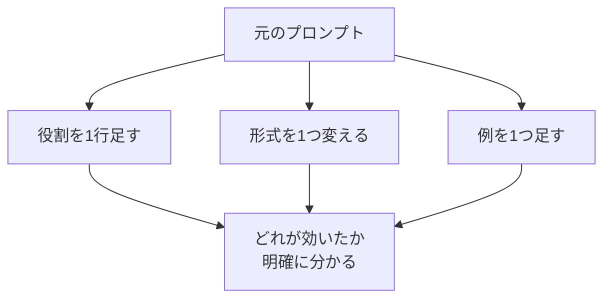

## このセクションで学ぶこと

- 複数箇所を同時に変えると、何が効いたのか分からなくなること
- 一度に1要素だけ変える反復で、修正と効果の因果を特定する方法
- 出力にはばらつきがあるため、複数回試してから判断すること

## なぜ「一度に1つ」なのか

改善を急ぐと、つい一気にあれもこれも直したくなります。「役割も足して、形式も変えて、例も追加して……」と3か所いじって、出力が良くなったとします。さて、**何が効いたのでしょうか?** 役割かもしれないし、例だけで十分だったかもしれない。3つのうち1つは逆効果だったのに、他の2つで打ち消されていただけかもしれません。同時に変えると、原因と結果の対応がつかなくなります。

これは理科の実験と同じです。条件を1つだけ変えて他を固定するから、その条件の効果が分かる。プロンプト改善でも **一度に1要素だけ変える** のが鉄則です。遠回りに見えて、結局これが一番速く正解にたどり着きます。



## 変えた内容と結果を記録する

1要素ずつ変えるなら、**何を変えてどうなったか** を残しておくと迷子になりません。凝ったツールは不要で、メモでも十分です。

```text
v1: 元のプロンプト        → 箇条書きにならない
v2: v1 + 「箇条書きで」    → 箇条書きになったが冗長
v3: v2 + 「各項目1行で」   → OK。これを採用
```

このように「前のバージョンに対して1つだけ加えた差分」を並べておくと、どの変更が効いたかが一目で分かります。効かなかった変更(あるいは逆効果だった変更)は元に戻し、効いた変更だけを積み上げていきます。

## 注意点

- **出力にはばらつきがある**。LLM は同じプロンプトでも実行ごとに違う出力を返します(第1章の確率的な仕組みのため)。1回だけ見て「直った/直らない」と断定せず、**同じプロンプトを2〜3回試して** 傾向で判断します。1回たまたま良かっただけ、ということがよくあります。
- **「変えていないつもり」に注意**。入力データを別の例に差し替えると、それも立派な変更です。プロンプトの効果を見たいなら、入力は固定して文言だけを変えます。
- 変えた結果が **少し悪くなっても、すぐ戻さず観察** します。なぜ悪くなったかが分かれば、それも有益な手がかりです。
- 改善が煮詰まったら、小さな修正をやめて **構造ごと書き直す** のも手です。1要素ずつは強力ですが、出発点が悪いと局所最適に陥ります。

## まとめ

- 同時に複数箇所を変えると、何が効いたか分からなくなる。一度に1つだけ変える
- 「前バージョン + 差分1つ」を記録すると、効いた変更だけを積み上げられる
- 出力にはばらつきがあるので、1回でなく複数回試して傾向で判断する
