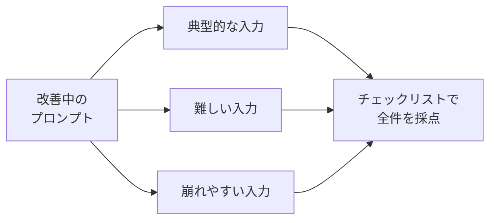

## このセクションで学ぶこと

- 「良い」を曖昧な印象でなく、判定可能な基準に落とすこと
- チェックリストとテスト入力で、出力を再現可能に評価する方法
- LLM 自身に評価させるやり方と、その注意点

## 「良い」を判定できる形にする

前の2セクションは「直す手順」でした。ですが、そもそも **何が良いのか** が決まっていないと、直す方向が定まりません。「良い感じ」「いまいち」という印象だけで改善していると、人によって・気分によって判定がぶれます。改善のループを安定させるには、**良し悪しを判定できる基準** を先に決めておく必要があります。

評価基準は難しく考えず、**チェックリスト** として書き出すのが手軽です。たとえば「カスタマーサポートの返信を生成するプロンプト」なら、こんな具合です。

```text
[ ] 顧客の質問に直接答えているか
[ ] 敬語で、かつ事務的すぎないトーンか
[ ] 200字以内に収まっているか
[ ] 事実を勝手に創作していないか(価格・納期など)
[ ] 「確認します」で逃げずに次の行動を示しているか
```

各項目は **その場でYes/Noを判定できる粒度** にするのがコツです。「丁寧か」だと曖昧ですが、「敬語になっているか」なら誰でも判定できます。判定できる基準は、そのまま改善のゴールになります。

## テスト入力をそろえる

基準と並んで重要なのが **テスト入力** です。同じプロンプトでも、入力次第で出来不出来が変わります。1つの入力でうまくいっても、別の入力で崩れたら意味がありません。そこで、代表的な入力を数件そろえて、毎回同じセットで試します。



「典型例」だけでなく、**わざと難しい例・崩れやすい例**(空欄が多い、長すぎる、想定外の質問など)を混ぜておくと、プロンプトの弱点が早く見つかります。これは第3章で扱った「出力が崩れたとき」への備えにもなります。

## LLM に評価させる — 便利だが過信しない

テスト入力が増えると、人手の採点はつらくなります。そこで、**出力の評価を別の LLM に任せる**(LLM-as-a-judge と呼ばれます)方法があります。「次の基準で、この回答を5点満点で採点して」とチェックリストを渡せば、大量の出力をまとめて評価できます。

ただし注意点があります。評価用 LLM は **基準を明示しないと甘く採点しがち** で、長い回答を高評価する癖などの偏りもあります。人間が数件は必ず目視で確認し、LLM の採点が信用できるかを先に確かめてください。評価の自動化は便利ですが、**評価基準そのものを作る責任は人間側** に残ります。

## まとめ

- 改善の前に「良い」を判定できる基準を決める。Yes/Noで判定できる粒度のチェックリストにする
- 代表例・難しい例・崩れやすい例をそろえ、毎回同じテスト入力で採点する
- 大量評価は LLM に任せられるが、基準の明示と人間の目視確認は欠かせない
