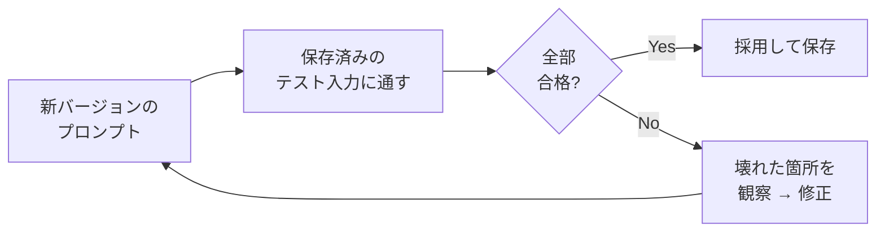

## このセクションで学ぶこと

- 良いプロンプトは使い捨てでなく、保存・再利用する「資産」だと捉えること
- バージョン管理とテストで、改善を後戻りなく積み上げる方法
- 変わる部分をテンプレート化して、プロンプトを使い回す方法

## せっかく育てたプロンプトを捨てない

前の3セクションで、観察 → 仮説 → 修正のループを回し、評価基準で良し悪しを測る方法を学びました。そうやって苦労して育てたプロンプトを、**チャットの履歴に埋もれさせて二度と見つけられなくなる** —— これが実務で一番もったいない失敗です。

うまくいったプロンプトは、コードと同じく **再利用できる資産** です。次に同じ種類のタスクが来たとき、ゼロから書き直すのではなく、前回のものを呼び出して少し直すだけで済みます。そのためにまずやることは単純で、**良かったプロンプトに名前を付けて保存する** だけです。テキストファイル、メモアプリ、社内 Wiki、なんでも構いません。「議事録要約 v3」のように用途とバージョンが分かる名前を付けておきます。

## バージョンとテストをひもづける

プロンプトを直すたびに上書きすると、「前の方が良かった」と思ったときに戻れません。前セクションの差分メモ(v1 → v2 → v3)を、そのまま **バージョン履歴** として残しておきます。各バージョンには「何のために、何を変えたか」を一言添えます。

さらに、05-03 でそろえた **テスト入力とチェックリスト** をプロンプトと一緒に保存しておくと、強力な仕組みになります。プロンプトを変更したとき、保存しておいたテスト入力に通し直し、**以前うまくいっていた入力が壊れていないか** を確認できます。これを **回帰テスト** と呼びます。新しい入力に対応しようと直した結果、古い入力が崩れてしまう、というのはよくある事故です。



## 使い回すためにテンプレート化する

同じプロンプトを別の対象に使い回すなら、**毎回変わる部分を差し込み口にする** のがコツです。これが **テンプレート化** です。

```text
あなたはプロのライターです。
以下の文章を{対象読者}向けに、{文字数}字以内で要約してください。

# 文章
{本文}
```

`{対象読者}` `{文字数}` `{本文}` のような **プレースホルダ** を置いておけば、枠組み(役割・指示・形式)は固定したまま、中身だけ差し替えて何度でも使えます。アプリやエージェントに組み込むときも、この差し込み口にプログラムから値を入れる形になります(第6章で扱います)。

## 注意点

- **凝った管理ツールから始めない**。最初はテキストファイル1枚で十分です。仕組みより「捨てずに残す」習慣のほうが先です。
- **変更理由を必ず残す**。差分だけ見ても、半年後の自分は「なぜこう直したか」を覚えていません。一言の理由がプロンプトの価値を保ちます。
- **テンプレート化しすぎない**。なんでも変数にすると枠組みが崩れます。本当に毎回変わる部分だけを差し込み口にします。

## まとめ

- うまくいったプロンプトは名前を付けて保存し、資産として使い回す
- バージョン履歴とテスト入力をひもづけ、回帰テストで改善を後戻りなく積む
- 毎回変わる部分だけをプレースホルダにしてテンプレート化すると使い回せる
