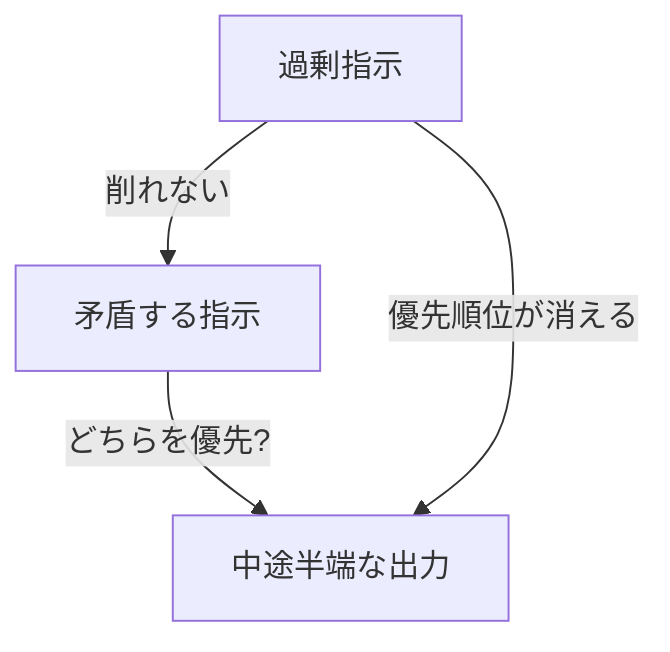

## このセクションで学ぶこと

- 過剰指示・矛盾する指示・丸投げ・呪文信仰という4つの典型的な失敗
- それぞれがなぜ出力を悪くするのか、仕組みの観点からの理解
- アンチパターンを避けて、必要十分なプロンプトに整える方法

## やりがちな4つの失敗

ここまでの章で、構造の設計から評価駆動の反復まで「やると良いこと」を学んできました。最後に視点を裏返して、**やってしまいがちな失敗パターン**を4つ集めます。良いプロンプトを増やすより、悪いプロンプトを減らすほうが手早く効くことは多いものです。

**1. 過剰指示** —— よかれと思って注文を盛りすぎる失敗です。「丁寧に、簡潔に、専門用語は避け、でも正確に、箇条書きで、ただし長くなりすぎず…」と並べていくと、モデルはどれを優先すべきか分からなくなります。第1章で見たとおり、プロンプトは出力の確率分布を絞り込む行為ですが、指示が多すぎると**絞り込む方向が分散して**、かえって平凡な出力に戻ってしまいます。本当に外せない指示だけに削るほうが効きます。

**2. 矛盾する指示** —— 過剰指示の中でも特にたちが悪いのが、両立しない注文の同居です。「簡潔に、ただし詳しく」「自由に発想して、ただし指示通りに」。人間なら空気を読んで折り合いをつけますが、モデルは第1章で学んだとおり**察してくれません**。どちらかに倒れるか、中途半端な出力になります。優先順位を自分の中で決め、片方に寄せて書きます。

## 丸投げと呪文信仰

**3. 丸投げ** —— 過剰指示の逆方向の失敗です。「この資料、いい感じにまとめて」のように、文脈も出力形式も示さず判断を任せきりにします。モデルは無難な一般解を返すしかなく、「思っていたのと違う」が量産されます。第2章の4要素(指示・文脈・入力・出力形式)のうち、最低限**何のために・どんな形で**欲しいかだけでも添えると、丸投げから抜け出せます。

**4. 呪文信仰** —— 「深呼吸して一歩ずつ考えて」のような、効くと評判のフレーズを**検証せずに貼り付け続ける**態度です。こうしたフレーズが効く場面はありますが、それは魔法ではなく、第4章で学んだ「思考を外に出させる」効果の言い換えにすぎません。タスクが変われば効かないこともあります。第5章で学んだ評価の姿勢 —— **付けた / 外した で出力が本当に良くなったか測る** —— を忘れ、おまじないとして盲信するのが呪文信仰です。

## 注意点

- アンチパターンは**程度問題**です。指示が多いこと自体が悪いのではなく、優先順位が消えるほど盛るのが悪いのです。
- 丸投げと過剰指示は**正反対の失敗**です。自分がどちらに寄りやすいか知っておくと、修正が速くなります。
- 評判のテクニックを否定する必要はありません。**自分のタスクで効くか測ってから採用する**、という第5章の姿勢を保てば呪文信仰には陥りません。

## まとめ

- 過剰指示は優先順位を消し、矛盾する指示は出力を中途半端にする
- 丸投げは文脈と形式の欠落、呪文信仰は効果の未検証から生まれる
- 必要十分に削り、優先順位を決め、効果を測る習慣で4つとも避けられる
