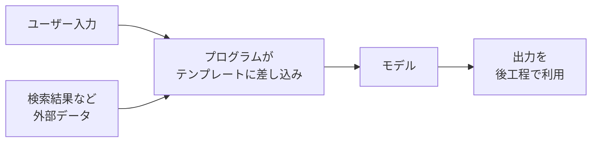

## このセクションで学ぶこと

- チャットで手打ちするプロンプトと、アプリ・エージェントに組み込まれるプロンプトの違い
- プログラムがプロンプトを組み立てるとき、新しく重要になる論点
- ここまで学んだ技芸が、次に学ぶ教材の土台になるという見通し

## プロンプトは「打つもの」から「組み立てられるもの」へ

ここまで私たちは、チャット画面に**人間が手で打つ**プロンプトを前提にしてきました。実務でプロンプトが本当に力を発揮するのは、その先 —— アプリやエージェントの**内部に組み込まれた**ときです。

たとえばカスタマーサポートの自動応答を考えます。ユーザーが質問を入力すると、プログラムが裏側で次のようなプロンプトを**毎回自動で組み立てて**モデルに送ります。

```text
あなたはサポート担当です。以下のFAQだけを根拠に、丁寧に回答してください。

# FAQ
{検索でヒットしたFAQ本文}

# ユーザーの質問
{入力された質問}
```

`{検索でヒットしたFAQ本文}` と `{入力された質問}` は、前章で学んだ**テンプレートの差し込み口**です。固定の枠組み(役割・指示・形式)はあなたが設計し、変わる部分だけをプログラムが流し込みます。つまり **05-04 で学んだテンプレート化が、そのままアプリの心臓部になる** のです。



## 組み込むと何が変わるのか

手打ちと組み込みで、技芸そのものは変わりません。変わるのは**前提**です。

第一に、**入力を人間が見ていません**。手打ちなら変な出力が出ても自分で気付いて打ち直せますが、自動で動く仕組みでは誰もチェックしていません。だから第3章の出力形式の固定(JSON など)や、第5章の評価とテストが、「あると良い」から「ないと回らない」に格上げされます。

第二に、差し込まれる値が**信頼できない外部入力**になりがちです。ユーザー入力も検索結果も、あなたが書いた文字列ではありません。ここで前セクションの **プロンプトインジェクション** が現実の脅威になります。テンプレートの差し込み口は、攻撃の入り口でもあるのです。

第三に、モデルの出力が**次の行動の引き金**になります。出力をそのまま検索クエリにしたり、別のモデル呼び出しに渡したりして多段で動く仕組みを **エージェント** と呼びます。出力が崩れると後続が全部崩れるため、一段ごとの安定性がより重要になります。

## 注意点

- 組み込みでも**プロンプトを書く技芸は同じ**です。本教材で学んだ4要素・出力制御・反復改善は、すべてそのまま効きます。新しく覚えるのは「自動で回る前提での設計」だけです。
- アプリ化・エージェント化は**プログラミングの領域**に入ります。本教材はプロンプトそのものに集中したため、ここから先は専門の教材に譲ります(次セクションと末尾の案内を参照)。
- いきなり複雑なエージェントを目指さないでください。まずは「テンプレートに値を流し込む単純な呼び出し」から始めるのが堅実です。

## まとめ

- 実務のプロンプトは、人間が打つものからプログラムが組み立てるものへ移る
- 組み込むと「人間が見ていない・外部入力が混ざる・出力が次の行動を呼ぶ」前提が加わる
- ここまでの技芸はそのまま土台になり、その先はアプリ開発・エージェントの領域に続く
