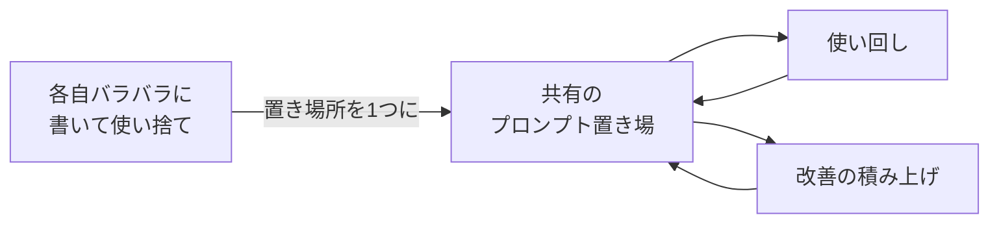

## このセクションで学ぶこと

- 良いプロンプトを個人の頭の中に留めず、チームで共有・再利用する意義
- 評価基準・変更理由・テスト入力をセットで残し、改善を積み上げる方法
- 本教材の学びの振り返りと、次に進むべき教材への入り口

## プロンプトは個人技から共有資産へ

前章で、うまくいったプロンプトは名前を付けて保存する「資産」だと学びました。チームで仕事をするなら、その資産を**自分の手元だけに留めない**ことが次の一歩です。

実務でよく起きるのは、同じようなプロンプトを各メンバーがバラバラに書き直し、しかも誰のものが一番良いか分からない状態です。これは個人技のまま放置した結果です。**置き場所を1つ決めて持ち寄る** —— 共有のドキュメント、リポジトリ、社内 Wiki、何でも構いません —— だけで、車輪の再発明が止まり、良いプロンプトがチーム全体に広がります。

## 改善が積み上がる残し方

ただ置くだけでは、半年後には「なぜこの書き方なのか」が誰にも分からなくなります。改善が積み上がるように、次の3つをプロンプトとセットで残します。

第一に **共通の評価基準** です。05-03 で作った「何をもって良い出力とするか」を、個人の感覚ではなくチームの言葉でそろえます。ものさしが共通なら、誰が直しても判断がぶれません。

第二に **変更理由** です。05-04 のバージョン履歴をチームで共有し、「何のために、何を変えたか」を一言残します。これがないと、良かれと思った修正で他人の工夫を上書きしてしまいます。

第三に **テスト入力** です。回帰テストに使う代表的な入力を共有しておけば、誰が直しても「以前うまくいっていたものが壊れていないか」をすぐ確認できます。プロンプトインジェクションを試す入力を混ぜておくと、組み込み利用での事故も早く見つかります。

## 注意点

- **重い運用ルールから始めない**でください。最初は「置き場所を1つ決めて、変更理由を一言書く」だけで十分です。仕組みより、捨てずに持ち寄る習慣が先です。
- プロンプトは**陳腐化します**。モデルが更新されると、効いていた工夫が不要になったり逆効果になったりします。共有資産は一度作って終わりではなく、定期的に測り直す対象です。
- 共有する以上、**機密情報をプロンプトに直書きしない**注意も要ります。差し込み口(プレースホルダ)に分離しておけば、枠組みだけを安全に共有できます。

## 本教材のまとめと、次に学ぶこと

この教材では、プロンプトを**書く技芸そのもの**に集中してきました。出力が確率分布で決まる仕組み(第1章)、4要素への分解(第2章)、出力の制御(第3章)、推論を引き出す技法(第4章)、評価駆動の反復(第5章)、そしてアンチパターンと実務接続(本章)。一本の幹が通ったはずです。

ここから先、**プロンプトをアプリやエージェントに組み込む**段階に進みたくなったら、次の2つの教材が入り口になります。

- **「LLMアプリ開発(LangChainエコシステム)」** —— プロンプトテンプレートを使い、検索結果を差し込んで回答させる(RAG)など、プロンプトをプログラムから扱う土台を学べます。
- **「AIエージェント」** —— モデルの出力に応じて行動を選び、多段で動く仕組みの設計を学べます。本章で触れた権限最小化やインジェクション対策が、より実践的に効いてきます。

どちらに進んでも、本教材で身につけた「曖昧さを減らし、出力を制御し、測って直す」感覚が土台になります。

## まとめ

- 良いプロンプトは個人技にせず、置き場所を1つ決めてチームの共有資産にする
- 評価基準・変更理由・テスト入力をセットで残すと、改善が後戻りなく積み上がる
- 次は LLM アプリ開発・AI エージェントの教材へ。本教材の技芸がその土台になる
