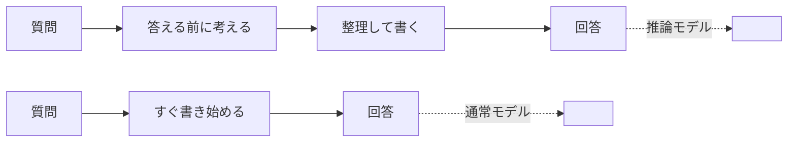

## このセクションで学ぶこと

- 従来の生成 AI が「即答」型で、推論モデルは「考えてから答える」型であること
- 推論モデルが答える前に、頭の中で考えを進める時間を持つこと
- 見た目は同じチャット画面でも、答え方の性質が大きく違うこと

## いつもの AI は「即答」している

ChatGPT のような **生成AI** を使うと、質問を送った瞬間から文字がスラスラと流れ出してきます。これは、AI が受け取った文章の続きとして「次に来そうな言葉」を一語ずつ選び、そのまま書き出しているからです。考えをまとめてから話し始めるというより、**話しながら同時に考えている**のに近い状態です。

この **即答** のやり方は、雑談・要約・翻訳のように「思いついた順に書いてもだいたい正しくなる」タスクではとても快適です。速くて、なめらかで、待たされません。日常的な質問の多くは、この即答型で十分にこなせます。

一方で弱点もあります。難しい計算や、いくつもの条件を突き合わせる問題では、最初の一歩を勢いで書き出してしまい、途中で辻褄が合わなくなっても後戻りできません。人間でも、考えずに口から出た答えが間違っていることはよくあります。それと同じことが起きます。

たとえば「A さんは B さんより年上、B さんは C さんより年上、では一番若いのは誰か」といった問題を考えてみます。慌てて書き始めると条件を取り違えやすいですが、一度立ち止まって関係を並べれば正しく答えられます。即答型はこの「立ち止まる間」を持ちにくい、というのが弱点の正体です。

## 推論モデルは「考えてから答える」

これに対して **推論モデル** は、質問を受け取ってもすぐには答えを書き始めません。まず頭の中で「どう解こうか」「この条件はどうなるか」と考えを進め、道筋がついてから最終的な答えを提示します。人間でいえば、口を開く前に一度深呼吸して段取りを組むイメージです。

下の図は、両者の処理の流れを並べたものです。

見た目はどちらも同じチャットです。違うのは、回答が出るまでの間に「考える工程」が挟まっているかどうかです。推論モデルでは、この考える時間のぶん回答までに少し待たされますが、そのかわり難しい問題での正確さが上がります。

## 注意点 — 「賢い」より「答え方が違う」

ここで大事なのは、推論モデルが従来モデルより一律に「賢い」わけではない、という点です。答え方の性質が違うだけで、簡単な質問なら即答型のほうが速くて十分なこともよくあります。「考えてから答える」のはコスト（時間）を払う行為であり、その価値があるのは難しい問題のときです。どちらが上かではなく、**答え方のタイプが違う道具**だと捉えておくと、この先の話がすっと入ってきます。

## まとめ

- 従来の生成 AI は「即答」型で、話しながら答えを組み立てる
- 推論モデルは答える前に考えを進める「考えてから答える」型
- どちらが賢いかではなく、答え方のタイプが違う道具として捉える
