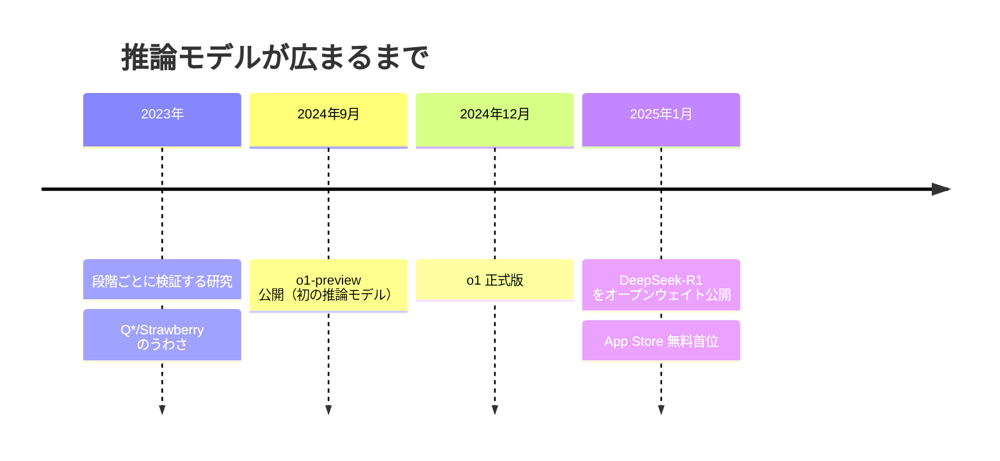

## このセクションで学ぶこと

- 2024 年 9 月の o1-preview が、推論モデルの本格的な出発点だったこと
- 2025 年 1 月の DeepSeek-R1 で、推論モデルが一気に世の中へ広まったこと
- その手前に「段階ごとに正しさを確かめる」という研究の積み重ねがあったこと

## 研究の源流 — 段階を確かめるという発想

「考えてから答える AI」は、ある日突然生まれたわけではありません。手前には研究の積み重ねがあります。2023 年には、答えだけでなく **途中の考えの一段ごとに正しさを評価する** という研究（"Let's Verify Step by Step"）が発表されました。最終的な正解・不正解だけを見るのではなく、思考の各ステップにごほうびを与えて育てる、という発想です。

同じ 2023 年の 11 月ごろには、OpenAI 社内で「Q\*（キュースター）」「Strawberry」と呼ばれる、数学が得意な次世代技術のうわさが飛び交いました。真偽ははっきりしないものの、「考える工程を鍛える」方向に各社が動いていた空気を伝えるエピソードです。

## 2024 年 9 月 — o1 の登場

そして 2024 年 9 月 12 日、OpenAI が **o1-preview** を公開します。o シリーズ初の推論モデルで、答える前に頭の中で考えを進める工程を、一般の人が初めて手軽に触れられるようになりました。正式版の o1 は同年 12 月 5 日に登場します。o1 は数学やプログラミングの難問で従来モデルを大きく上回り、「考える時間を取れば AI はここまで正確になるのか」と話題になりました。

## 2025 年 1 月 — DeepSeek-R1 で一気に広まる

流れが決定的になったのは翌 2025 年 1 月です。中国の DeepSeek 社が **DeepSeek-R1** を 1 月 20 日に **オープンウェイト** で公開しました。中身が公開され、しかも無料で使えたことで、多くの人が推論モデルを直接体験できるようになります。反響は大きく、1 月 27 日にはアメリカの App Store で無料アプリのダウンロード数首位に立ちました。

## 注意点 — 「発明」より「広まり方」に注目

この物語で大切なのは、誰が一番だったかという順位争いではありません。研究の下地があり、o1 が形にし、DeepSeek-R1 が無料公開で一気に裾野を広げた——という **手法が世の中に広まっていく流れ** です。わずか数か月で「考えてから答える AI」が特別なものから当たり前の選択肢へと変わっていったことこそ、押さえておきたいポイントです。

もう一つ覚えておきたいのは、DeepSeek-R1 の衝撃が「性能そのもの」だけでなく「誰でも中身を確かめて動かせる形で出てきたこと」にもあった点です。閉じた最先端だった技術が公開されたことで、研究者も企業も一斉にこの方向へ動き出しました。以後、Claude や Gemini など各社のモデルも次々に推論の機能を備えていきます。

## まとめ

- 2023 年の「段階を検証する」研究などが下地になった
- 2024 年 9 月の o1-preview が推論モデルの本格的な出発点
- 2025 年 1 月の DeepSeek-R1 が無料公開で一気に裾野を広げた
