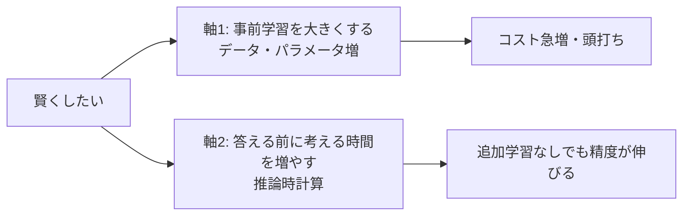

## このセクションで学ぶこと

- 従来は「事前学習を大きくする」ことで AI を賢くしてきたが、頭打ちが見え始めたこと
- 推論モデルは「答える前に考える時間を増やす」という別の軸を開いたこと
- この新しい軸こそが、いま推論モデルが注目される理由であること

## これまでの賢くする軸 — とにかく大きくする

ここ数年、AI を賢くする方法はおおむね一つの方向でした。**事前学習** を大きくする、というやり方です。つまり、読ませるデータを増やし、モデルの **パラメータ**（中身の調整つまみ）を増やし、より大きな計算資源で学習させる。大きくすればするほど賢くなる——この関係が長く成り立ってきました。世代を追うごとにモデルが巨大になっていったのは、この経験則を信じてのことです。

ただ、この方向にはコストの壁があります。倍賢くしようとすると、データも計算費用も何倍にも膨らみます。良質なデータには限りもあります。世界中の文章を学び尽くすほど、次に読ませる新しいデータを見つけること自体が難しくなっていきます。こうして「とにかく大きくする」だけでは、これ以上の伸びが割に合わなくなってきた、という **頭打ち** の感覚が広がってきました。

## 新しい軸 — 答える前に考える時間を増やす

推論モデルが開いたのは、これとは別の軸です。学習の段階を大きくするのではなく、**答えるときに考える時間を増やす** という方向です。同じモデルでも、じっくり考えさせれば正確さが上がる。この「考える時間」に費やす計算量を **推論時計算**（test-time compute）と呼びます。

この軸のうれしさは、**巨大な学習をやり直さなくても賢さを引き出せる** 点にあります。学習をやり直すには何か月もの時間と莫大な費用がかかりますが、考える時間を増やすのは答えるそのときの調整で済みます。難しい問題のときだけ長く考えさせ、簡単な問題ならさっと答えさせる、という使い分けも効きます。「賢くする方法がもう一つ見つかった」ことが、推論モデルが大きく注目された核心です。

## 注意点 — 二つの軸は対立しない

誤解しやすいのは、新しい軸が古い軸を否定した、という受け取り方です。そうではありません。土台となる事前学習の上に、考える時間という軸が **積み増された** と考えるのが正確です。しっかり事前学習された賢い土台があってはじめて、じっくり考える価値が出てきます。実際、大きなモデルほど、長く考えさせたときの伸びも大きくなる傾向があります。二つは競争相手ではなく、組み合わせて使うものです。この「新しい軸が加わった」という感覚を持っておくと、次章以降の「頭の中で何が起きているか」がぐっと分かりやすくなります。

## まとめ

- 従来は「事前学習を大きくする」ことで賢くしてきたが頭打ちが見えてきた
- 推論モデルは「答える前に考える時間（推論時計算）を増やす」新しい軸を開いた
- 二つの軸は対立せず、組み合わせて使うもの
