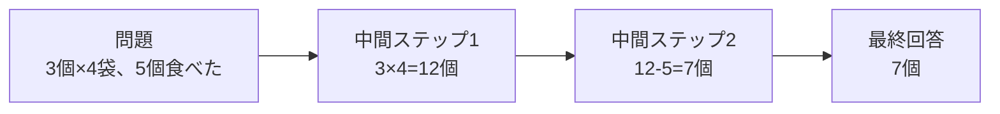

## このセクションで学ぶこと

- チェーンオブソートとは「答えを一発で出さず、中間の考えを段階的に書き出す」進め方であること
- 途中の考えをつないでいくから「思考の連鎖(チェーン)」と呼ばれること
- 段階に分けると、人にとってもモデルにとっても筋道を追いやすくなること

## 考えを「声に出す」とどうなるか

第1章では、推論モデルが「即答」ではなく「考えてから答える」タイプの AI だという話をしました。では、その「考える」とは具体的に何をしているのでしょうか。中心にあるのが **チェーンオブソート** という考え方です。日本語にすると「思考の連鎖」で、その名のとおり、途中の考えをひとつずつ鎖のようにつないでいく進め方を指します。

イメージしやすいのは、人が難しい問題を解くときに「声に出して手順を考える」場面です。たとえば暗算で「17 × 6」を求めるとき、いきなり答えを言うのではなく、「17 を 10 と 7 に分けて、10 × 6 は 60、7 × 6 は 42、足して 102」と口の中でつぶやきますよね。この一言ずつの独り言が、まさに **中間ステップ** です。チェーンオブソートは、この独り言を AI にもやらせる、というだけの素朴な発想です。

大事なのは、この独り言が「あってもなくても答えは同じはず」ではない、という点です。頭の中だけで一気に処理しようとすると、人でも AI でも情報を取りこぼしがちになります。ところが手順を一つずつ言葉にして外に置いてやると、直前のステップを土台にして次を考えられるので、うっかりミスが起きにくくなります。考えを書き出すこと自体が、正解に近づくための工夫なのです。

## 具体例:間違えにくくなる並べ方

たとえば「リンゴが 3 個入った袋が 4 つあります。そこから 5 個食べました。残りは何個?」という問題を考えてみます。一発で答えようとすると、うっかり掛け算と引き算を混同してしまうかもしれません。ですがチェーンオブソートでは、次のように順を追います。

一気に「7 個」と言い切るのではなく、「まず全部で 12 個」「そこから 5 個引いて 7 個」と分けています。ひとつの段階でやることが小さくなるので、途中でつまずいても気づきやすく、結果として間違いが減ります。この「途中の考えを残す」こと自体が、推論モデルの賢さの入り口になっています。

## 注意点:考えを書くのは最終回答のためだけではない

ここで一つ押さえておきたいのは、途中のステップは「答えを出すための足場」であって、それ自体が最終的な回答ではない、という点です。モデルはまず考えを一通り展開し、その積み重ねの上で最後に結論をまとめます。つまり、私たちが受け取る「答え」の裏側には、こうした段階的な思考がぶら下がっているわけです。

では、その裏側の思考は私たちの目に見えるのでしょうか。それとも隠されているのでしょうか。製品によって扱いが違うこの点を、次のセクションで見ていきます。

## まとめ

- チェーンオブソートは、答えの前に中間の考えを段階的に書き出す「思考の連鎖」のこと。
- 人が声に出して手順を追うのと同じで、段階に分けると筋道を追いやすく間違いが減る。
- 途中のステップは最終回答のための足場であり、その見え方は次のセクションで扱う。
