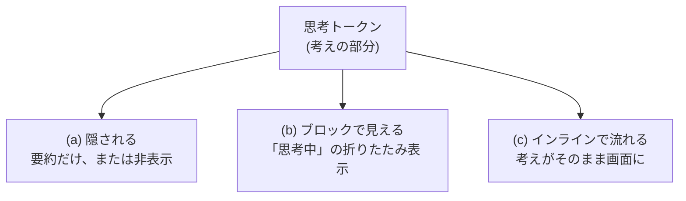

## このセクションで学ぶこと

- 思考トークンとは、モデルが回答の前に生成する「考えの部分」であること
- その扱いは製品によって「隠される」「ブロックとして見える」「インラインで流れる」と異なること
- 見えても見えなくても、裏では同じように段階的な思考が走っていること

## 思考にも「文字数」がある

前のセクションで見たチェーンオブソートは、頭の中だけで起きるふわっとしたものではありません。実際には、モデルが途中の考えを **文章として書き出して** います。AI が文章を生成するときは、単語や文字のかたまりである **トークン** を一つずつ並べていきます。このうち、最終回答ではなく「考えの部分」に使われるトークンを **思考トークン** と呼びます。

つまり推論モデルは、答えを返す前に「まず考えを書く」という余分な仕事をしています。この考えの分だけトークンが増えるので、思考トークンは料金や待ち時間にも関わってきます。しっかり考えるほど思考トークンは長くなる、という関係があると覚えておくとよいでしょう。

言い換えると、私たちが最終的に受け取る短い回答の裏側には、それより何倍も長い「考えの下書き」が隠れていることも珍しくありません。難しい問題ほどこの下書きは膨らみます。この下書きにあたる部分が思考トークンであり、推論モデルらしさが宿っているのはまさにこの見えにくい部分なのです。

## 具体例:製品によって「見え方」が3通り

面白いのは、この思考トークンをユーザーにどう見せるかが、製品によってバラバラだという点です。大きく3つの扱いがあります。

**(a) 隠される** タイプでは、考えの中身は見せず、最終回答だけ(または短い要約だけ)を返します。**(b) ブロックとして見える** タイプでは、「thinking(思考中)」といった折りたたみエリアに考えがまとまって表示され、開くと途中経過を読めます。**(c) インラインで流れる** タイプでは、考えが回答と地続きに画面へ流れていきます。同じ「考えてから答える」でも、見せ方はこれだけ違うのです。

## 注意点:見えないからといって考えていないわけではない

ここで勘違いしやすいのが、「考えが表示されない=手を抜いている」ではない、という点です。(a) のように隠されている場合でも、裏では (b) や (c) と同じように段階的な思考が走っています。単に、その中身を画面に出すかどうかの方針が違うだけです。

なぜ隠すことがあるのかというと、途中の考えには言い間違いや遠回りも含まれるため、そのまま見せると混乱を招くことがあるからです。また、考え方そのものを手の内として明かしたくない、という事情もあります。いずれにせよ、私たちが受け取る「答え」の裏に思考トークンがある、という事実は変わりません。見える・見えないは表示の話であって、賢さの有無ではないと押さえておきましょう。

## まとめ

- 思考トークンは、モデルが回答前に生成する「考えの部分」のトークン。
- 見せ方は製品ごとに「隠す」「ブロックで見せる」「インラインで流す」の3通りがある。
- 見えなくても裏では同じく段階的に考えているので、表示の有無と賢さは別物。
