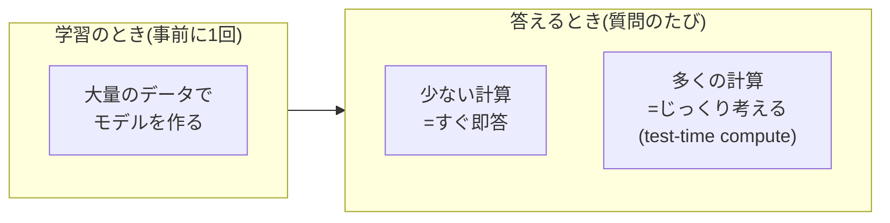

## このセクションで学ぶこと

- AI の計算には「学習するとき」と「答えるとき」の2つの場面があること
- test-time compute とは、答えるときに計算を多く使って「考える時間」を増やす発想であること
- 追加で考えた分だけコストや待ち時間も増える、というトレードオフがあること

## 計算を使う場面は2つある

AI が計算資源(コンピュータの処理能力)を使う場面は、大きく2つに分けられます。ひとつは **学習** のとき。大量のデータを読み込んでモデルを作り上げる、いわば「勉強する」段階です。もうひとつは **推論** のとき。出来上がったモデルが実際に質問を受けて答えを返す、「本番」の段階です。

これまでの生成 AI では、賢さのほとんどは学習の段階で決まると考えられてきました。たくさん勉強させて大きなモデルを作れば作るほど賢くなる、という発想です。ここに新しく加わったのが **test-time compute**(推論時計算)という考え方です。test-time、つまり「答えるとき」に計算をたくさん使えば、その場でもっと賢く振る舞えるのではないか、というものです。

## 具体例:考える時間を「お金で買う」

test-time compute のいちばんの勘所は、「**考える時間を計算資源で買う**」という感覚です。前のセクションで、しっかり考えるほど思考トークンが長くなると話しました。思考トークンを長く生成するには、その分だけ計算が必要です。逆に言えば、計算を多く投じれば、モデルはより多くの中間ステップを踏み、より念入りに考えられます。

たとえば同じ難しい数学の問題でも、「さっと 3 ステップだけ考えて答える」のと「50 ステップかけて何度も見直しながら答える」のとでは、後者のほうが正解しやすくなります。この「何ステップぶん考えさせるか」を、計算資源の量で調整できるわけです。学習をやり直さなくても、答えるときの計算を増やすだけで賢くできる。これが推論モデルの新しさの核心です。

## 注意点:考えるほどタダではない

便利な発想ですが、ただではありません。考える時間を計算で買う以上、たくさん考えさせれば **料金も待ち時間も増えます**。じっくり 50 ステップ考えるモデルは、即答するモデルより遅く、割高になりがちです。

ですから「常に長く考えさせればよい」わけではなく、問題の難しさに応じて考える量を選ぶ、という感覚が大切になります。簡単な質問に大量の計算をかけるのは、電卓で済む計算に大型コンピュータを持ち出すようなものです。どんな問題で深く考える価値があるのか——それは次の第3章「なぜ考えると賢くなるのか」で見ていきます。

## まとめ

- AI の計算には「学習のとき」と「答えるとき」があり、test-time compute は後者を増やす発想。
- 答えるときの計算を増やすほど、より多くの中間ステップを踏んでじっくり考えられる。
- ただし考えた分だけコストと時間も増えるので、問題に応じて考える量を選ぶ感覚が要る。
