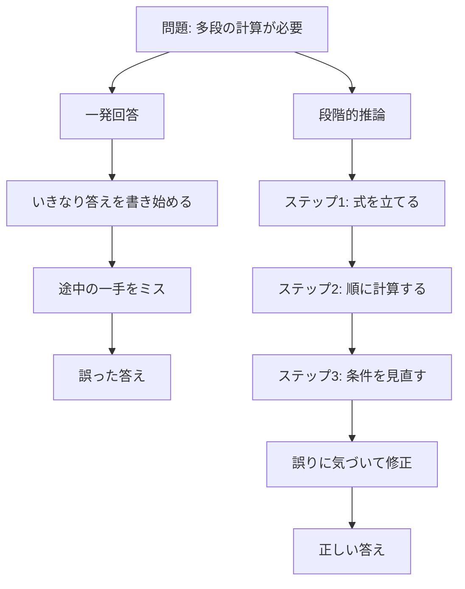

## このセクションで学ぶこと

- 問題を小さなステップに分けると、なぜ間違いが減るのか
- 途中で誤りに気づいて直せる「見直しの余地」とは何か
- 数値例で、段階を踏む効果の大きさをイメージする

## 大きな問題を小分けにする

難しい問題を一度に片付けようとすると、頭の中でいくつものことを同時に扱うことになり、どこかで取りこぼしが起きます。そこで有効なのが、問題をいくつかの **中間ステップ** に分け、一つずつ処理していくやり方です。第 2 章で見たチェーンオブソート(考えを段階に分けて進めること)は、まさにこれを AI にやらせる工夫でした。

一つのステップで扱うことが少なくなれば、その一手を正しく処理できる可能性は上がります。10 個のことを同時に考えるより、1 個ずつ 10 回に分けたほうが、一つひとつは確実になる、という感覚です。

さらに大切なのは、途中の結果が目に見える形で残ることです。人間が計算用紙に途中式を書くのと同じで、AI も自分の思考を書き出しておくと、「さっきの計算、単位がおかしいぞ」と **見直しの余地** が生まれます。一発回答では書いた先から確定していきますが、段階を踏めば途中で立ち止まって直せるのです。間違いを最終結果まで持ち越さずに、その場で拾い直せることが、正答率を大きく押し上げます。

## 一発回答と段階的推論の対比

同じ問題でも、答え方の違いで結果が変わります。次の図は、一発回答で誤る流れと、段階を踏んで正解に至る流れを対比したものです。

左は前から一気に書き切るため、ミスがそのまま最終結果に流れ込みます。右は各ステップで確認と修正ができるので、途中の誤りを吸収できます。同じ問題・同じ知識でも、答え方の作りが違うだけで結果が分かれる、というところが大事なポイントです。難しくしているのは問題そのものより、「一度に全部を処理しようとすること」だとも言えます。

## 数値で見る効果

この違いは、実際の成績にはっきり表れます。アメリカの難しい数学コンテスト「AIME(2024 年)」の問題を解かせた例では、従来モデルの正答率がおおよそ **12%** だったのに対し、段階を踏んで考える思考モデルはおよそ **74%** に達しました。ここでの正答率は **pass@1**、つまり一回の解答でどれだけ正しく答えられたかを表しています。

6 倍以上の開きです。モデルの土台となる知識量が急に増えたわけではありません。持っている力を、段階を踏むことで取りこぼさずに引き出せるようになった、と考えると分かりやすいでしょう。

ひとつ補っておくと、この 74% は従来モデルにそのまま「順を追って答えてね」と頼むだけで出る数字ではありません。上手に段階を踏むよう **別途鍛えられた思考モデル** の成績です。「段階を踏む」という答え方の変更が効くのは事実ですが、そう振る舞えるように仕込まれていることが前提になります。その仕込み方(次のセクションの強化学習)まで込みで、これほど大きく伸びる、というわけです。段階を踏むことは、単なる丁寧さではなく、正しくたどり着くための実質的な力なのです。次のセクションでは、この上手な段階の踏み方を AI がどうやって身につけたのかを見ていきます。

## まとめ

- 問題を中間ステップに分けると、各ステップの負担が減って誤りが減る
- 思考を書き出すと途中の誤りに気づいて直せる見直しの余地が生まれる
- AIME 2024 で約 12% → 約 74%(pass@1)と、効果は数値にもはっきり表れる
