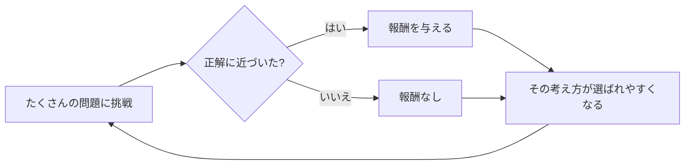

## このセクションで学ぶこと

- 良い思考に「ごほうび」を与えて強化するとは、どういうことか
- なぜ正解に近づく考え方が自然と選ばれるようになるのか
- DeepSeek-R1 の特徴を大まかにイメージする

## ごほうびで考え方を育てる

前のセクションで、段階を踏むと間違いが減ることを見ました。では AI は、その「上手な段取り」をどうやって身につけたのでしょうか。ここで登場するのが **強化学習** という学び方です。

強化学習は、犬にお手を教える様子を思い浮かべると分かりやすいです。うまくできたときにおやつをあげ、そうでないときはあげない。これを繰り返すうちに、犬は「こうすればおやつがもらえる」という行動を自然と多く取るようになります。この「おやつ」にあたるのが **報酬** です。望ましい結果に「良かったよ」という信号を返すことで、学習の方向づけをします。

推論モデルの場合、AI にたくさんの問題を解かせ、正解にたどり着けた考え方には報酬を与えます。すると、正解に結びつきやすい考え方が少しずつ選ばれやすくなっていきます。誰かが「こう考えなさい」と手取り足取り教えるのではなく、AI 自身が試行錯誤しながら、うまくいく段取りを見つけていくのです。数学のように答え合わせがはっきりできる問題は、報酬を与える基準(正解かどうか)が明確なので、この学び方ととても相性が良い分野です。

このループを何度も回すうちに、AI は「まず整理する」「途中で見直す」といった上手な考え方を、だんだんと自分のものにしていきます。一回一回の学びはごく小さな調整ですが、膨大な回数を積み重ねることで、少しずつ「考え方のクセ」が良い方向へ育っていく、というイメージです。

## DeepSeek-R1 の場合

第 1 章で名前が出た **DeepSeek-R1** は、この強化学習を前面に押し出したことで注目を集めました。従来は「人間が書いたお手本の思考をたくさん真似させる」やり方が中心でしたが、DeepSeek-R1 は、主に強化学習によって推論力を伸ばした点が特徴です。つまり、細かい手本を大量に用意しなくても、報酬という目印を頼りに AI 自身が考え方を鍛えていける、という道筋を示したのです。

ここでは数式やアルゴリズムの中身には踏み込みません。大切なのは、「良い思考にごほうびを与えて試行錯誤で強化する」という直感です。この仕組みがあるからこそ、推論モデルは段階を踏む力を身につけられたのだと押さえておけば十分です。

## 注意点

強化学習と聞くと難しそうですが、「うまくいったらごほうび」という骨格はとてもシンプルです。一方で、何を「良い」とするか(報酬の決め方)は簡単ではなく、そこが各社の工夫のしどころでもあります。この章では、その入り口だけをつかめれば十分です。次の章では、こうして力をつけた推論モデルの得意・不得意を見ていきます。

## まとめ

- 強化学習は、良い思考に報酬を与えて試行錯誤で強化する学び方
- 正解に近づく考え方が自然と選ばれやすくなる
- DeepSeek-R1 は主に強化学習で推論力を伸ばした点が特徴
