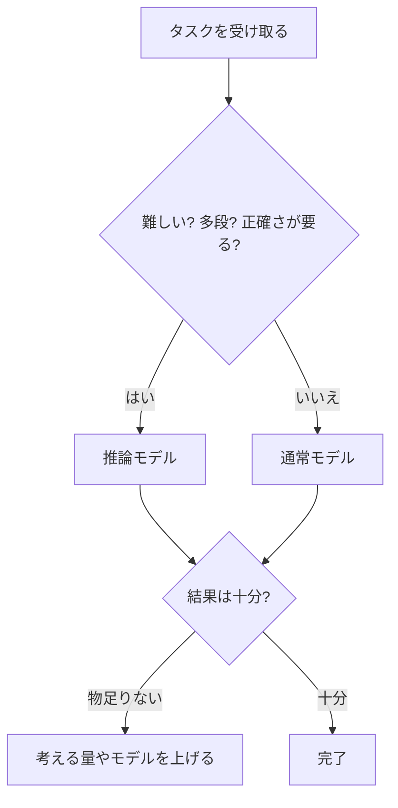

## このセクションで学ぶこと

- 目の前のタスクを見て、通常モデルと推論モデルのどちらが向くかを判断できるようになります
- 「難しさ・多段・正確さ」が高いほど推論モデル寄りになる、という目安をつかみます
- 迷ったときは軽いほうから試す、という実務的な進め方を知ります

## 難しさ・多段・正確さの三つで見分ける

前の章までで、推論モデルと通常モデルにはそれぞれ得意・不得意があることを見てきました。ここからはいよいよ、実際に手を動かすときの選び方です。とはいえ難しく考える必要はありません。目の前のタスクに対して、次の三つを自分に問いかけるだけです。

一つめは「難しいか」。答えるのに専門的な思考や込み入った検討が要るなら、推論モデル寄りです。二つめは「多段か」。一足飛びには答えが出ず、多段の推論を順に踏む必要があるなら、やはり推論モデル寄りです。三つめは「正確さがどれだけ要るか」。少しの間違いも許されない、あるいは筋道が合っているか検証したいなら推論モデルが安心です。

逆に、これらがどれも当てはまらないとき——つまり「速さ・安さ・単純さ」のほうが大事なとき——は通常モデルで十分です。この見分け方を一枚の流れにすると、次のようになります。

## 具体例で当てはめてみる

たとえば「打ち合わせのお礼メールを書く」「長い記事を三行に要約する」「気軽な相談に乗ってもらう」——こうした作業は、速くて安い通常モデルがぴったりです。わざわざじっくり考えさせる必要はありません。

一方で「入り組んだ数学の文章題を解く」「複数の条件が絡む予定を矛盾なく組む」「大きなプログラムの設計を筋道立てて考える」といった作業は、推論モデルの出番です。ひとつ間違えると全体が崩れるような、多段の推論が必要な場面だからです。

見分けの目安をもう少し補うと、「途中でひとつでも読み違えると答え全体が狂う」タイプの問題ほど推論モデルが向いています。数学やパズル、込み入った条件のある計画がまさにそれです。反対に、多少ゆらいでも大きな害がなく、量をこなす速さのほうが価値になる作業——たくさんの短文をさばく、下書きを次々つくる——は通常モデルの領分です。どちらか一方しか使えないわけではなく、同じ仕事の中でも「下ごしらえは通常モデル、要の判断だけ推論モデル」と役割を分ける手もあります。

## 迷ったら軽いほうから

見分けに自信がないときは、まず通常モデルで試してみるのが実務的です。結果が十分ならそれでよし、物足りなければ推論モデルに切り替えたり、考える量を増やしたりすればよいのです。何でもかんでも推論モデルに任せると、時間とコストばかりかさんでしまいます。「軽いほうから始めて、必要なら重くする」——この順番を覚えておくと無駄がありません。頼み方そのものにもコツがあり、それは次のセクションで見ていきます。

## まとめ

- 「難しさ・多段・正確さ」が高いほど推論モデル、そうでなければ通常モデルを選びます
- お礼メールや要約は通常モデル、込み入った数学・計画・設計は推論モデルが向きます
- 迷ったら軽いほうから試し、物足りなければ重くする、が無駄のない進め方です
