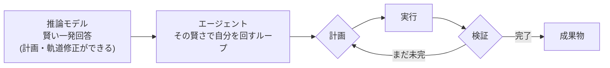

## このセクションで学ぶこと

- エージェントが「計画→実行→検証」を自分でくり返す仕組みだと分かるようになります
- それが2025年に急に実用化した理由を、「土台のモデルが推論できるようになったから」と説明できるようになります
- 推論モデルとエージェントの関係を、"賢い一発回答"と"その賢さで自分を回すループ"として整理します

## エージェントとは — 自分で回すAI

最近「AIエージェント」という言葉をよく聞くようになりました。これまで学んできた推論モデルとは、何が違うのでしょうか。

推論モデルは、難しい問いに対して頭の中でじっくり考え、優れた答えを一回返してくれるものでした。いわば"賢い一発回答"です。これに対して エージェント は、AI が自分で 計画を立て、実行し、結果を検証する——というループをくり返し、多くの段階からなる仕事を最後までやり遂げる仕組みです。

たとえば「この資料を調べて報告書にまとめて」と頼むと、エージェントはまず段取りを考え、必要な情報を集め、下書きを書き、それを自分で読み返して直し……と、人が指示しなくても次の一手を自分で決めながら進みます。一問一答ではなく、目的に向かって自走するのが特徴です。

## なぜ急に実用化したのか

こうした「自分で動くAI」の構想は、実はずっと前からありました。それなのに、実用的に動くようになったのは2025年になってからです。なぜでしょうか。

答えは、この教材の主役そのものにあります。土台のモデルが「推論」できるようになったからです。

自分で回るループには、二つの力が欠かせません。一つは、次に何をするかを筋道立てて決める 計画 の力。もう一つは、途中の結果を見て「これはうまくいっていない」と気づき、やり方を立て直す 軌道修正 の力です。どちらも、まさに推論モデルが第3章で身につけた「段階を踏んで考える」力そのものです。

かつての即答モデルは、この二つが苦手でした。長い手順の途中で道を見失い、間違ったまま突き進んでしまう。だから自走させても、すぐに破綻していたのです。推論モデルが計画と軌道修正をこなせるようになって初めて、ループは最後まで回りきるようになりました。エージェントの実用化は、推論モデルという土台が整った結果なのです。

## 賢い一発回答から、自分で回すループへ

ここまでの関係を一枚にすると、こうなります。推論モデルは"賢い一発回答"。エージェントは、その賢さを使って自分自身を何度も回す"ループ"。エージェントは推論モデルを置き換えるものではなく、その上に乗る発展形です。

賢く考える土台があるからこそ、その上でループが回る。この順番を押さえておくと、次々に登場するエージェント製品も「ああ、推論の力を自走に使っているのだな」と見通せるようになります。

## まとめ

- エージェントは「計画→実行→検証」を自分でくり返し、多段のタスクを自走してこなす仕組みです
- 2025年に急に実用化したのは、土台のモデルが推論(計画・軌道修正)できるようになったからです
- 推論モデルは"賢い一発回答"、エージェントは"その賢さで自分を回すループ"という関係です
