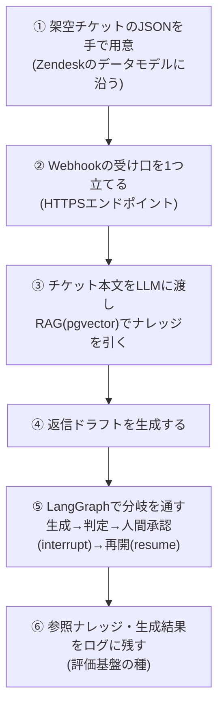

## このセクションで学ぶこと

- チケット受信からログ記録までのend-to-end 6ステップ
- 各ステップが後続のどの章に対応するか
- 詰まりにくい実装順の見取り図

## 6ステップの全体フロー

ミニ・プロトタイプは、次の6ステップを**この順**で組むと詰まりにくくなります。上流(データ形式)から下流(ログ)へ、依存関係の順に積み上げる流れです。ここで大事なのは、最初から本番のWebhookや本物のZendeskに繋ぎ込もうとしないことです。入力(チケットJSON)を手で固定してしまえば、以降のステップは外部サービスの都合に振り回されずに一人で開発できます。

## 各ステップを一言で

- **① チケットJSONを用意** — まず入力を固定します。実際のWebhookを待たず、Zendeskのデータモデルに沿った架空チケットを手で書くことで、後段の開発をすぐ始められます。
- **② Webhook受け口** — チケットが飛んでくるHTTPSエンドポイントを1つ立てます。最初は①のJSONを流し込むだけで構いません。
- **③ RAGでナレッジ検索** — 受けた本文をLLMに渡し、**RAG**(pgvector)で関連ナレッジを引きます。
- **④ 返信ドラフト生成** — 引いたナレッジを添えて、返信の下書きを生成します。
- **⑤ LangGraphで承認分岐** — 「生成 → 十分か判定 → 人間承認(**interrupt / resume**)→ 再開」を分岐として通します。いきなり自動送信せず、人間が承認する形にするのが安全設計の肝です。
- **⑥ ログに残す** — 参照したナレッジと生成結果を記録します。後で評価基盤に育てる種になります。「どのチケットに対し、どのナレッジを引き、何を生成し、人間がどう判断したか」を残しておくと、精度改善や顧客への説明材料としてそのまま使えます。

この順番には理由があります。もし②のWebhookから作り始めると、入力が安定しないまま後段を書くことになり、どこで壊れているのか切り分けにくくなります。①で入力を固定し、③④で中身の価値(RAG + 生成)を先に確かめ、⑤で承認という運用上の要を足し、最後に⑥で記録を回収する。この積み上げなら、各ステップで「ここまでは動く」を確認しながら進められます。

## この6ステップが教材全体の地図になる

各ステップは、後続の章で深掘りする内容にそのまま対応します。この章はその**見取り図**です。

- ①② → **第2章 Zendesk**(データモデル・Webhook・書き戻しAPI)
- ⑤ → **第3章 LangGraph**(checkpoint・interrupt / resume・承認グラフ)
- (指標の土台)→ **第4章 CS指標**(どの自動化がどの指標に効くか)
- ②③⑥ → **第5章 インフラ**(Webhook受け口・pgvector・BigQueryログの4 surface)
- ⑤⑥ → **第6章 提案・地雷回避**(根拠提示・段階リリース・ドラフト提案からの安全設計)

## まとめ

- プロトタイプは「JSON → Webhook → RAG → ドラフト → 承認分岐 → ログ」の6ステップで組む。
- 上流から下流へ依存順に積むと詰まりにくい。
- 各ステップが第2〜6章に対応し、この章が全体の地図になる。
