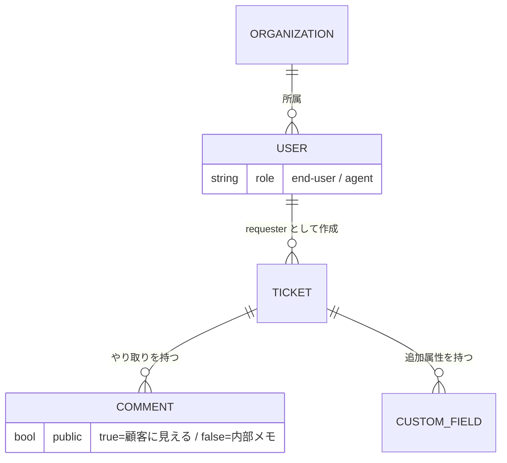

## このセクションで学ぶこと

- Ticket を中心に Comment / User / Organization / custom fields がどうつながるか
- `public comment`(顧客に見える返信)と `internal note`(内部メモ)の決定的な違い
- custom fields が「案件ごとに増える属性の箱」であること

## Ticket が中心、あとはそこにぶら下がる

Zendesk のデータモデルは、**Ticket(チケット)を中心に据えると一気に見通しがよくなります**。チケットとは「顧客からの1件の問い合わせ」を表すオブジェクトで、私たちが外から叩くとき最初に触れる単位です。返信も、担当者も、会社情報も、追加属性も、すべてこのチケットにぶら下がる形で関連づきます。

チケットにぶら下がる主な登場人物は4つです。**Comment** はチケット内のやり取り1件分。**User** はそのやり取りに関わる人で、問い合わせてくる顧客(End-user)とサポート担当(Agent)の2種類があります。**Organization** は会社・団体単位で複数の User をまとめる箱で、B2B サポートでは「どの顧客企業からの問い合わせか」を表します。そして **custom fields** は、標準の属性では足りないときに足す追加のフィールドです。

## public comment と internal note の違いが最重要

自前エージェントを作るうえで**絶対に押さえるべきなのが Comment の2種類**です。Comment には「顧客に見える public comment」と「内部だけの internal note」があります。public comment は顧客のメール画面やヘルプセンターに表示される正式な返信で、internal note はエージェント側にしか見えない内部メモです。

タイプ3の構成では、AI が生成した返信は**まず internal note として書き戻す**のが基本の安全設計です。いきなり public comment で顧客に送るのではなく、内部メモにドラフトとして置き、人間のエージェントが確認・編集してから public として送る。この「どちらの Comment に書くか」を1ビット間違えると、未検証の AI 出力が顧客に直送されてしまうため、実装上もっとも神経を使うポイントです。

## custom fields は「箱の側面に穴を足す」イメージ

custom fields は、案件ごとに増えていく属性です。たとえば「AI が参照したナレッジ記事の ID」「AI 処理済みかどうか」「問い合わせカテゴリ」などを、標準フィールドとは別に足せます。自前エージェントからは、生成の根拠にした knowledge ID をここに書き込んでおくと、あとで「なぜこの返信になったか」を追跡できます。

注意点として、custom fields は顧客ごとに定義がバラバラになりがちです。受託では「どのフィールド ID に何を入れるか」を最初に握らないと、顧客が増えるたびに分岐が増えて保守が破綻します。

## まとめ

- Ticket を中心に Comment / User / Organization / custom fields がぶら下がる構造
- Comment は public comment(顧客に見える)と internal note(内部メモ)で意味が全く違う
- custom fields は案件ごとに増える追加属性。AI の参照根拠を記録する置き場に使える
