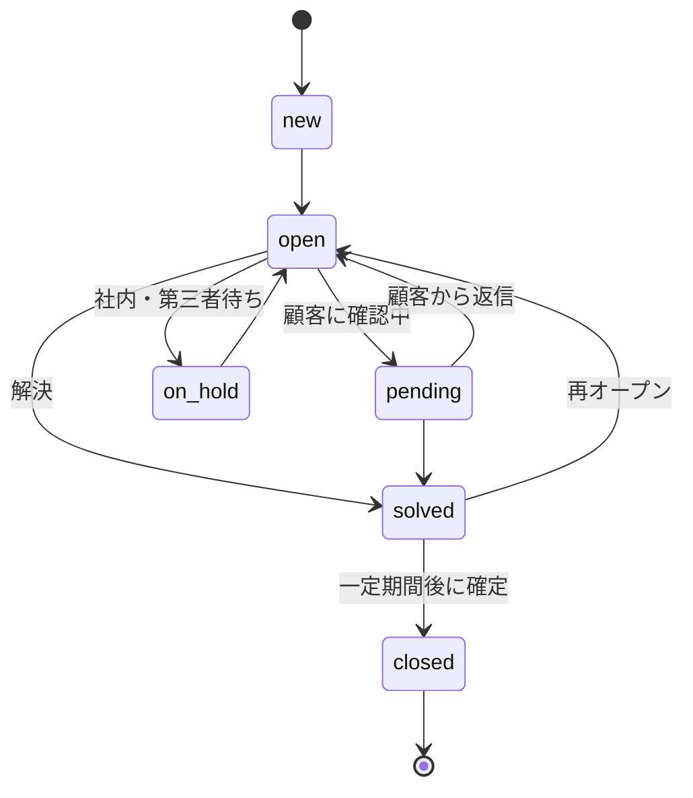

## このセクションで学ぶこと

- new → open → pending → solved という基本の status の流れ
- pending / solved / closed / on-hold それぞれが「誰のボールか」を表すこと
- status が AI の発火条件や書き戻しの判断材料になること

## status は「今どちらにボールがあるか」を表す

チケットには **status(状態)** があり、対応がどこまで進んだかを表します。基本の流れは `new → open → pending → solved` です。**new** は作成直後でまだ誰も着手していない状態、**open** はエージェントが対応中でボールがサポート側にある状態です。

分かりにくいのが **pending** と **solved** の区別です。**pending は「顧客の返信待ち」**で、ボールが顧客側に移っています。「追加情報をください」と聞いて返事を待っている状態がこれです。**solved は「解決したとみなす」状態**ですが、まだ確定ではありません。顧客が「まだ直っていません」と返信すれば再び open に戻る(再オープンされる)余地を残しています。

そして **closed は完全に確定した状態**です。もう編集も再オープンもできず、蒸し返す場合は新しいチケットを立てます。多くの環境では solved から一定期間後に自動で closed になります。このほか、社内の別部署待ちなど第三者要因の保留を表す **on-hold** もあります(顧客待ちの pending と区別されます)。

## AI から見た status の使いどころ

自前エージェントにとって status は**発火条件**であり**書き戻しの判断材料**でもあります。たとえば「new のチケットにだけ AI がドラフトを生成する」「pending(顧客待ち)には手を出さない」といった線引きに使えます。顧客のボールになっている pending にサポート側から追撃を書き戻すと、会話がちぐはぐになるため避けたいわけです。

さらに status は「AI をどこまで任せるか」の段階設計にも効きます。最初は new のチケットで internal note にドラフトを置くだけにとどめ、慣れてきたら open の段階まで対象を広げる、といった具合に status を軸に範囲を刻めます。ボールの所在が status に表れているからこそ、こうした線引きが自然に書けます。

注意点として、status は勝手に飛び越えて設定できるわけではなく、環境のワークフローに沿って遷移します。また closed になったチケットには API でコメントを追記できないため、書き戻しのタイミングを誤ると失敗します。solved はまだ書き戻せますが、closed になる前に処理を終える意識が要ります。「今この status で何ができるか」を意識しておくことが実装で効いてきます。

## まとめ

- 基本は new → open → pending → solved。pending は顧客待ち、solved は再オープン可能
- closed は確定で編集・再オープン不可。on-hold は第三者待ちで pending とは別物
- status は AI の発火条件・書き戻し可否の判断材料になる
