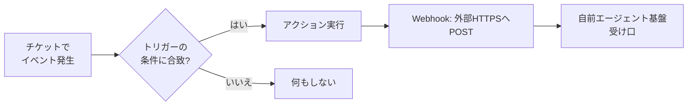

## このセクションで学ぶこと

- トリガーが「条件 → アクション」の自動化ルールであること
- アクションの一つ Webhook が外部 HTTPS への POST だということ
- どんな条件で自前エージェント基盤に飛ばすかの設計勘

## トリガーは「条件を満たすとアクションが走る」ルール

自前エージェント基盤への入口を理解するには、**トリガー**と **Webhook** をセットで押さえます。トリガーとは「**この条件を満たしたら、このアクションを実行する**」という Zendesk 側の自動化ルールです。条件は「新規チケットが作成された」「特定のタグが付いた」「status が open になった」など、チケットに関するイベントで指定します。

条件が満たされたときに走る処理が **アクション** です。アクションには「タグを付ける」「担当者を割り当てる」「メール通知する」などいろいろありますが、私たちが使うのは **Webhook** アクションです。Webhook は、あらかじめ登録しておいた**外部の HTTPS エンドポイントに向けて HTTP POST を送る**仕組みです。つまり「Zendesk 内でイベントが起きた瞬間に、その情報を自前サーバへ飛ばす」ための出口になります。

## 具体例 — 新規チケットを自前基盤に飛ばす

タイプ3の典型は「新規チケットが作成されたら Webhook で自前基盤に POST する」設定です。トリガーの条件を「チケット作成時」にし、アクションに「Webhook 送信」を選び、POST 先を自前サーバの受け口 URL にします。POST の中身(ペイロード)にはチケット ID やコメント本文などを入れ、受け取った側が RAG 検索 → ドラフト生成に進みます。

条件は絞れます。たとえば「タグ `ai-target` が付いたチケットだけ飛ばす」とすれば、AI に任せる対象を段階的に広げられます。最初は一部だけ Webhook で流し、様子を見て範囲を広げる、という安全な立ち上げができます。逆に言うと、トリガーの条件設計こそが「AI に何を任せるか」の入口の線引きそのものです。管理画面の細かな設定手順は本教材では追いませんが、「条件で対象を絞り、アクションで外に飛ばす」という骨格だけは押さえてください。

## 注意点

- **Webhook は POST を投げっぱなし**が基本です。自前側が遅いと Zendesk 側でタイムアウトするため、受け口はすぐ 200 を返し、重い処理は非同期に回すのが定石です(詳細は第5章)。
- 条件を緩くしすぎると全チケットが飛んできて、想定外の負荷やコストになります。まずは条件を絞って始めます。
- Webhook の送信元が本物の Zendesk か、署名などで検証する必要があります。エンドポイントは公開されるため無検証で信用しないこと。

## まとめ

- トリガー=「条件を満たすとアクションを実行する」自動化ルール
- アクションの一つ Webhook が外部 HTTPS への POST で、自前基盤への入口になる
- 条件(新規作成・タグ付与など)を絞って段階的に対象を広げるのが安全
