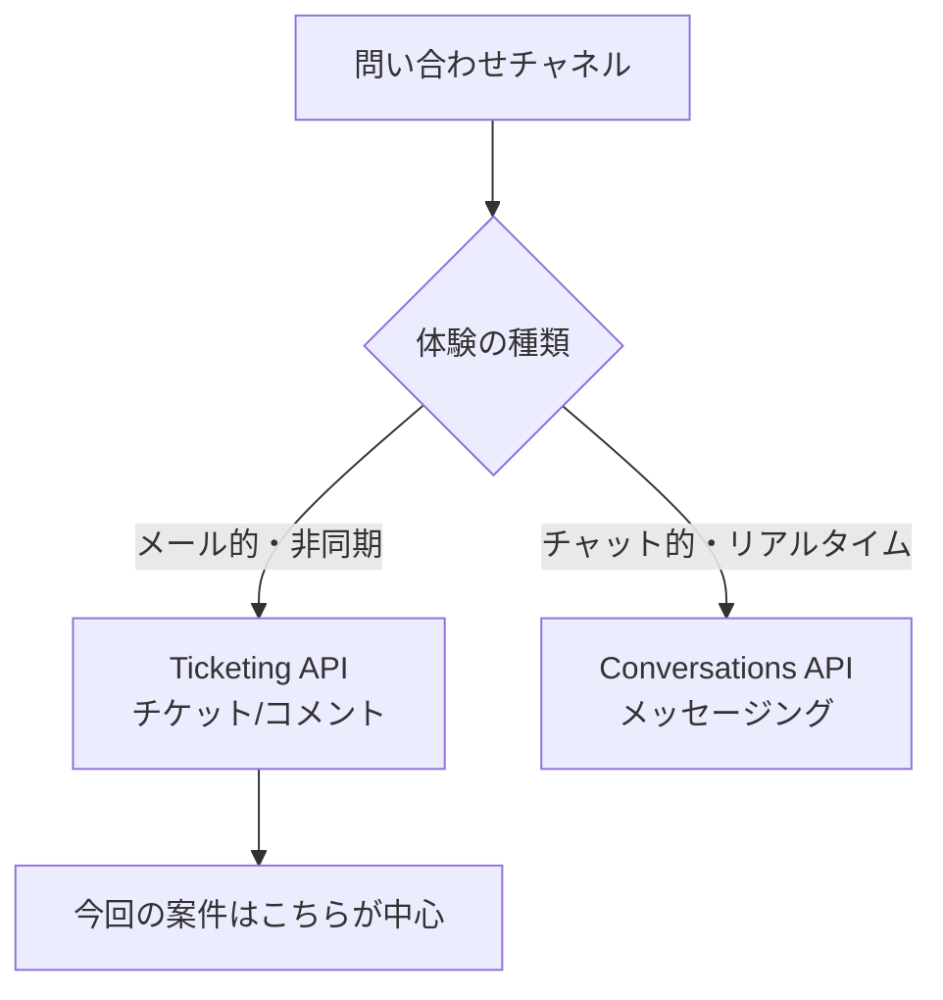

## このセクションで学ぶこと

- Ticketing API と Conversations API の使い分け
- 今回の案件がどちら側かの判断
- 純正 AI エージェントのサンセット動向と、それが提案ネタになること

## 2つの API は「非同期チケット」か「リアルタイムチャット」か

Zendesk を外から叩く API には大きく2系統あります。これまで見てきた **Ticketing API** は、メールのように**非同期でやり取りするチケット**を扱います。一方 **Conversations API** は、Web やアプリのチャットウィジェットで行う**リアルタイムのメッセージング**を扱う API で、Sunshine Conversations 系のメッセージング基盤に対応します。

使い分けの軸はシンプルです。**「メール的な問い合わせ対応」なら Ticketing API、「チャット的なリアルタイム対話」なら Conversations API**。今回のタイプ3案件は、Webhook でチケットを受け取り、ドラフトを internal note に書き戻す流れが中心なので、**基本は Ticketing API 側**と考えて差し支えありません。チャットの即時応答を組む要件が出てきたときに初めて Conversations API を検討します。

まず Ticketing API を軸に据え、Conversations API は「そういう別系統がある」と輪郭だけ知っておけば十分です。両者を最初から一緒に触ろうとすると、学習コストが跳ねてミニ・プロトタイプが進まなくなります。

## 純正AIエージェントのサンセットは提案の入口

もう一つ実務で効くのが、Zendesk **純正の AI エージェント機能のサンセット動向**です。レガシーな純正 AI 系機能が **2026年末に廃止予定とされており**、既存でそれを使っている顧客は代替への移行を迫られる、という流れがあります(正確な対象範囲と時期は公式アナウンスでの確認が必要です)。

これは受託にとって**移行提案のネタ**になります。「純正機能が終わるので、外部に自前エージェント基盤を持つタイプ3へ移しませんか」という提案が自然に成立するからです。純正機能はブラックボックスで手を入れにくい一方、タイプ3なら RAG のナレッジも承認フローも自分たちで作り込めます。廃止という外圧を、この作り込みの自由度を売る文脈に接続できるわけです。

ただし細部の年号や対象機能を断定してはいけません。「廃止が予定されているとされる。詳細は公式アナウンスの確認が必要」という温度で顧客と会話するのが安全です。断定して外すと信頼を損ねますし、逆に「いつ・何が終わるか一緒に確認しましょう」という姿勢自体が受託の入口になります。

## まとめ

- Ticketing API=非同期チケット、Conversations API=リアルタイムチャット。今回は前者が中心
- Conversations API は輪郭だけ知っておき、必要になってから触れば十分
- 純正 AI のサンセット(2026年末とされる)は既存顧客へのタイプ3移行提案の入口になる
