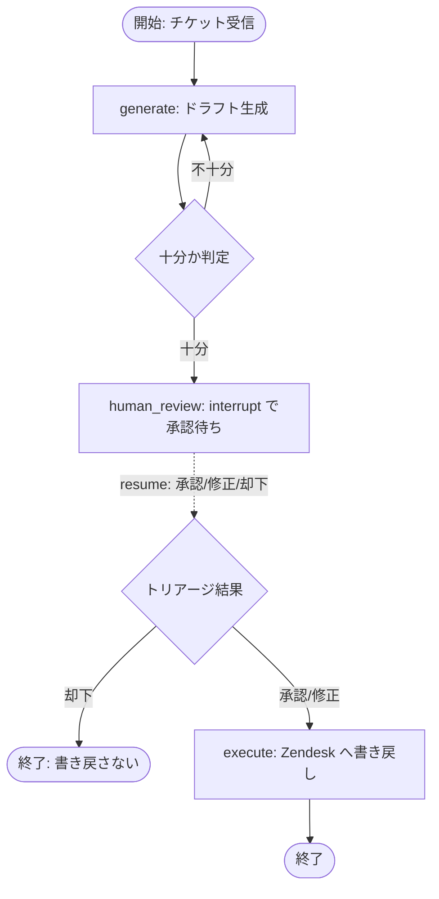

## このセクションで学ぶこと

- 生成 → 十分か判定 → 人間承認(interrupt) → 再開(resume) → AI実行 を1つのグラフにする
- 条件分岐で「十分なら承認へ、不十分なら再生成へ」を表現する
- Zendesk への書き戻しを「承認後の AI 実行」ノードに閉じ込める設計

## 「propose → 人間トリアージ → AI実行」の全体像

ここまでの checkpoint(03-01)と interrupt / resume(03-02)を組み合わせて、案件のプロトタイプの核となる分岐を1本のグラフにします。流れは、AI がドラフトを提示し(propose)、人間が承認・修正・却下する(トリアージ)、承認されたら AI が Zendesk へ書き戻す(AI実行)、の3段です。生成物が不十分なら人間を煩わせる前に AI が作り直す条件分岐も挟みます。



破線が interrupt で止まって resume で戻ってくる箇所です。人間の判断がグラフの外から注入され、その結果で次の遷移先が決まります。

## 条件分岐と承認ノードをコードにする

「十分か判定」は State を見て次のノード名を返す関数(conditional edge)で表します。承認ノードは 03-02 の interrupt をそのまま使い、書き戻しは承認後の execute ノードに閉じ込めます。

```python
from langgraph.graph import StateGraph, START, END
from langgraph.types import interrupt

def generate(state):
    return {"draft": call_llm(state["ticket_text"])}

def is_sufficient(state):  # 条件分岐: 次のノード名を返す
    return "human_review" if good_enough(state["draft"]) else "generate"

def human_review(state):
    decision = interrupt({"draft": state["draft"]})  # ここで停止
    return {"decision": decision}

def route_after_review(state):
    return "execute" if state["decision"]["approved"] else END

def execute(state):  # 承認後だけ Zendesk へ書き戻す
    post_comment_to_zendesk(state["decision"].get("edited_draft", state["draft"]))
    return {}

builder = StateGraph(State)
builder.add_node("generate", generate)
builder.add_node("human_review", human_review)
builder.add_node("execute", execute)
builder.add_edge(START, "generate")
builder.add_conditional_edges("generate", is_sufficient)
builder.add_conditional_edges("human_review", route_after_review)
builder.add_edge("execute", END)
graph = builder.compile(checkpointer=checkpointer)  # 03-01 の checkpointer
```

> `add_conditional_edges` の引数の形やルーティングの書き方はバージョンにより差異があります。実装時は公式ドキュメントで確認してください。

## 注意点

- **副作用(Zendesk への書き戻し)は execute ノードだけに置く**のが肝心です。generate や human_review に書き戻しを混ぜると、再生成ループや resume の再実行で二重投稿が起きます。
- 「十分か判定」で無限に再生成しないよう、リトライ回数の上限を State に持たせて打ち切る設計にします。
- 却下パスを必ず用意します。人間が「送らない」と決めたら、書き戻さずに終わる経路が要ります。

## まとめ

- propose → 人間トリアージ → AI実行 は、生成・承認・実行の3ノード+条件分岐で1本に描ける
- 十分か判定は conditional edge、承認は interrupt、再開は resume が担う
- 書き戻しは承認後の execute ノードに閉じ込め、二重実行と誤送信を防ぐ
