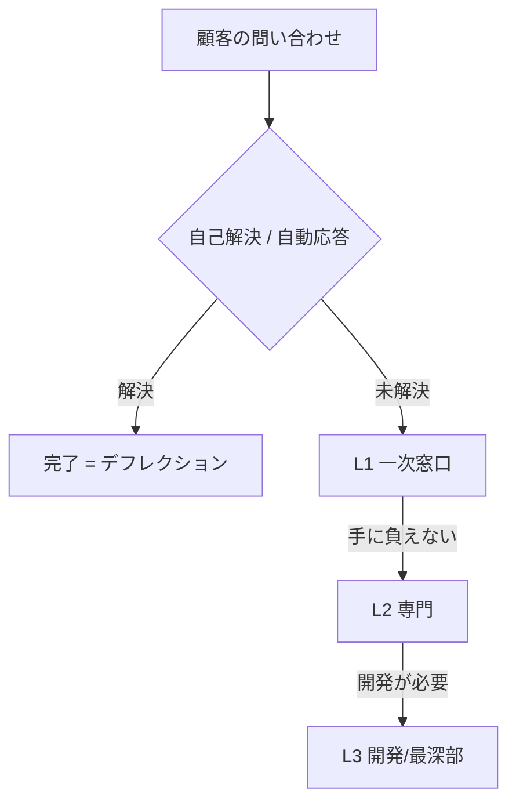

## このセクションで学ぶこと

- エスカレーションという言葉が指す動き
- L1 / L2 / L3 のティア構造と、それぞれが担当する範囲
- デフレクションや AI がこの構造のどこに効くのか

## エスカレーション — 手に負えないものを上へ渡す

サポートに来る問い合わせは、難易度がバラバラです。パスワードの再発行のような定型的なものもあれば、製品の不具合調査のように開発チームでないと分からないものもあります。

自分の担当範囲で解決できない問い合わせを、**より上位・専門の担当者へ引き継ぐこと** を **エスカレーション** と呼びます。「これは L2 にエスカレします」のように使います。

## ティア構造 — L1 / L2 / L3

多くのサポート組織は、対応の深さで層を分けた **ティア構造** を取ります。代表的なのが3層です。

- **L1**(一次窓口): 最初に問い合わせを受ける層。定型的・頻出の質問をその場でさばく。
- **L2**(専門): L1 で解決できない、製品知識や設定調査が必要な問い合わせを扱う専門層。
- **L3**(開発/最深部): 不具合の原因調査やコード修正など、開発に近い最も深い層。

問い合わせは下の層で受け、無理なものだけを上へエスカレーションしていきます。上の層ほど人数が少なく単価も高いので、**なるべく下の層で解決を完結させる** ほど組織全体は効率的になります。

## 具体例 — AI とデフレクションはどこに効くか

前のセクションのデフレクションは、図の一番上、**L1 に届く手前** で問い合わせを逸らす動きです。AI による返信ドラフト生成は、**L1 の内側** で担当者の処理を速くする動きです。

つまり「AI とデフレクションは、なるべく下の層・手前の段階で問い合わせを片付け、上位層へのエスカレーションを減らす」と位置づけられます。これは L2・L3 の高コストな時間を、本当に必要な難案件に集中させることにつながります。

この位置づけが分かると、提案の効きどころも説明しやすくなります。デフレクションは「そもそも L1 に来る量」を減らし、AI ドラフトは「L1 が1件あたりにかける時間」を減らす、というように、同じ効率化でも作用する場所が違います。顧客の悩みが「問い合わせが多すぎる」のか「1件あたりが遅い」のかで、どちらの打ち手を前面に出すかが変わってくるわけです。

## 注意点

- 層の数や呼び名(L1/L2/L3、Tier1/2/3 など)は企業によって違います。「下の層ほど定型・大量、上の層ほど専門・少数」という構図をつかめば、名前の差は読み替えられます。
- AI で何でも L1 だけで完結させようとすると、本来エスカレーションすべき難案件まで抱え込ませる危険があります。「どこまでを AI と L1 で完結させ、どこから上へ渡すか」の線引きは提案の重要な論点です。

## まとめ

- エスカレーションは、解決できない問い合わせを上位・専門の担当へ引き継ぐこと
- L1=一次窓口、L2=専門、L3=開発/最深部。なるべく下の層で完結させると効率的
- デフレクションは L1 の手前、AI ドラフトは L1 の内側に効き、上位へのエスカレーションを減らす
