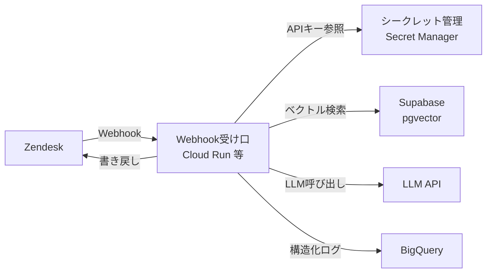

## このセクションで学ぶこと

- この案件で本当に触るインフラは「4つの surface」だけだと割り切ること
- Webhook の受け口を serverless で出すか container で出すかの違い
- agent 系の処理でなぜ container が効いてくるのか

## 触るのは4つの surface だけ、と最初に割り切る

インフラが苦手でも大丈夫です。この案件でエンジニアが実際に手を動かす面(surface)は、次の4つだけに絞れます。

1. **Webhook の受け口**(このセクション) — Zendesk からのイベントを受け取る入口をどう公開するか
2. **シークレット管理** — Zendesk / LLM の API キーをどこに置くか
3. **ベクトルストア** — RAG 用のベクトルを Supabase + pgvector に置く
4. **ログ / オブザーバビリティ** — 何を参照して何を返したかを残し、BigQuery に流す

逆に、**ネットワーク(VPC)/ コンテナオーケストレーション(k8s)/ CI/CD の作り込み / スケーリング設計は、今回は知らなくていい**と明言します。これらは重要ですが、ミニ・プロトタイプ1本を通すのに必須ではありません。手を広げず、この4面だけに集中してください。

4つの surface と外部サービス(Zendesk / LLM / Supabase / BigQuery)の関係は次のとおりです。

## serverless と container の違い

Webhook の受け口を公開する方法は、大きく2つあります。

- **serverless(Vercel Functions / Cloud Functions)** — 常駐サーバーを持たず、リクエストが来たときだけ関数が起動します。デプロイが速く、アイドル時はほぼ無料で、手軽さが魅力です。
- **container(Cloud Run など)** — コンテナにしたアプリを常駐、または長時間の処理を許容する形で動かします。1リクエストが長くても走り切れます。

小さな Webhook を受けて即レスするだけなら serverless で十分です。問題は、agent 系の処理がそう単純に終わらないことです。

## なぜ長時間処理だと serverless が辛いのか

タイプ3の agent は、1回のチケット処理で **LLM 呼び出し + RAG 検索 + (場合によっては)人間の承認待ち** を挟みます。これらは合計すると平気で数十秒〜数分に伸びます。ここで serverless の3つの制約が効いてきます。

- **タイムアウト上限**: serverless は1リクエストの実行時間に上限があり、長い処理は途中で打ち切られます。
- **コールドスタート**: しばらく呼ばれていないと起動に待ちが入り、応答が不安定になります。
- **実行時間課金**: 実行時間に対して課金されるため、待ち時間の長い処理を serverless で抱えるとコスト効率が悪くなります。

こうした「長くなりがちな処理」は、**Cloud Run のように常駐/長時間を許容できる container 側が素直**です。特に人間承認を挟む設計(第03章)では処理が中断・再開されるため、短命な serverless 前提だと組みづらくなります。まずは Cloud Run のような container を第一候補に置くと考えておけば十分です。

## まとめ

- 触るインフラは4 surface だけ。VPC / k8s / CI-CD / スケーリングは今回捨てる。
- Webhook 受け口は serverless(手軽)と container(長時間OK)の2択。
- agent はLLM+RAG+承認待ちで長くなりがち。タイムアウト/コールドスタート/課金の観点から Cloud Run 等の container が効く。
