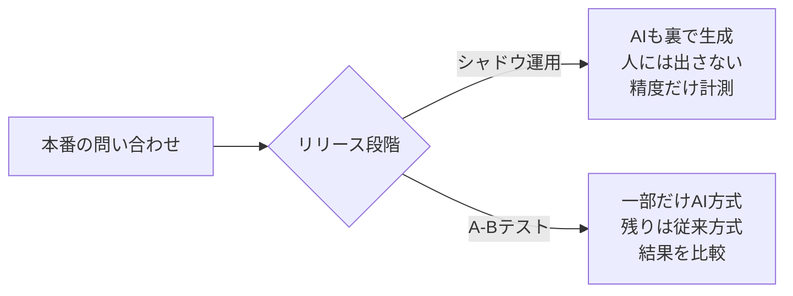

## このセクションで学ぶこと

- 過去チケットと理想返信のペアから評価データセットを作る流れ
- 第05章のログがそのまま評価データの種になること
- シャドウ運用と A-Bテスト、2 つの段階リリースの違いと目的

## 評価データセットは「過去チケット × 理想返信」で作る

「AI の精度は良いのか?」に答えるには、測るための物差しが要ります。それが **評価データセット** です。作り方はシンプルで、**過去のチケットと、それに対する理想的な返信をペアで集める** のが基本です。

- 入力: 実際に来た問い合わせ(例:「注文をキャンセルしたい」)
- 理想の出力: 熟練オペレーターが書いた模範返信、または承認済みの実返信

これを数十〜数百件そろえると、「新しいプロンプトやモデルに同じチケットを流して、理想返信にどれだけ近いか」を繰り返し測れるようになります。プロンプトを 1 行変えたときに、良くなったのか悪くなったのかを感覚ではなく数字で言えるのが強みです。

ここで効いてくるのが第05章です。ログ/オブザーバビリティを BigQuery に流しておけば、**実際のチケット・AI の生成・人間が承認した最終返信** がすでに蓄積されています。この「AI が書いたドラフト」と「人間が直した最終返信」の差分こそ、理想返信づくりの一級の素材です。第05章で「評価基盤の種を蒔く」と言ったのは、まさにこの評価データセットのことでした。

## 段階リリース — シャドウ運用と A-B

評価データセットで手元の精度を測れても、本番の生きたトラフィックで通用するかは別問題です。そこでいきなり全開放せず、**段階的にリリース** します。代表的な 2 つが「シャドウ運用」と「A-Bテスト」です。

**シャドウ運用** は、本番トラフィックに AI を並走させますが、その出力は誰にも出しません。裏でこっそり生成して、後から「もし出していたら正しかったか」を評価データと突き合わせて計測します。顧客にもオペレーターにも一切影響を与えずに、本番相当の精度を測れるのが利点です。

**A-Bテスト** は、一部のトラフィックだけを新方式(AI ドラフト提案あり)に振り分け、残りは従来方式のまま回して結果を比較します。応答時間や CSAT(第04章)が本当に改善するかを、実際のオペレーションの中で確かめます。

順番としては、シャドウ運用で「出しても大丈夫そう」を確認してから、A-B で「実際に効果が出るか」を測る、という流れが自然です。

## 注意点

- 評価データセットは一度作って終わりではありません。問い合わせの傾向は変わるので、定期的に足していく前提で設計します。
- 理想返信を集めるとき、個人情報を含む実チケットの扱いには注意が必要です。マスキングや利用範囲の合意を契約段階で握っておきます。
- シャドウ運用は「出さない」からこそ安全ですが、計測して終わりでは意味がありません。結果を次の改善に回す運用まで含めて提案します。

## まとめ

- 評価データセットは「過去チケット × 理想返信」のペアで作り、精度を数字で測る物差しにする
- 第05章のログ(ドラフトと承認済み返信)がそのまま評価データの種になる
- シャドウ運用で安全に精度を測り、A-Bテストで実効果を確かめてから広げる
