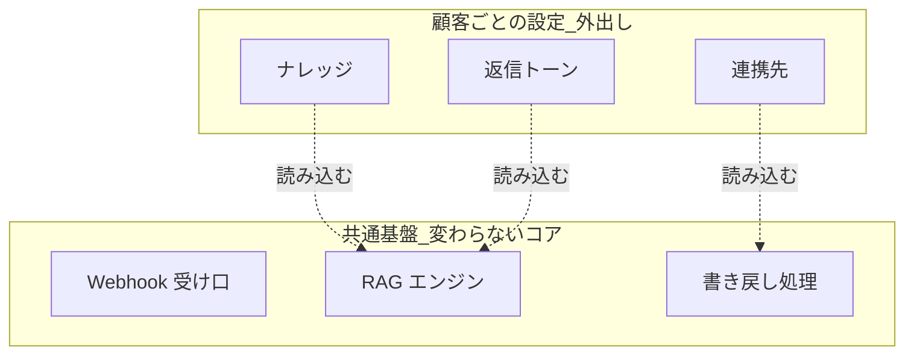

## このセクションで学ぶこと

- DoD(完了定義)を契約前に数値や条件で握る重要性
- 「DoD が機械判定できるか」を自動化スコープの線引き基準にする発想
- 顧客差分を外出しし、コアを共通基盤化して保守地獄を避ける構図

## DoD を契約前に握る — 「精度」は青天井になる

AI 案件で最も刺さる地雷が、**完了定義(DoD)の曖昧さ** です。「AI の精度を上げてほしい」という要求は、放っておくと青天井になります。90% で満足していた顧客が、稼働後に「なぜ 95% じゃないのか」と言い出す。ゴールが数字で固定されていないと、いつまでも「完成」になりません。

だから **契約前に、何をもって完成とするかを数値や条件で握る** ことが決定的に重要です。

- 「評価データセット(第06章前半)で一次応答の妥当率 85% 以上」
- 「ドラフト提案の採用率(担当者が大きく直さず送る割合)70% 以上」
- 「対象は返品・配送・アカウントの 3 カテゴリに限定」

このように、測れる指標と対象範囲をセットで決めます。ここで第06章前半の評価データセットが「合否を判定する物差し」として効いてきます。DoD を握るとは、測り方を握ることでもあります。

## 「機械判定できるか」で自動化スコープを線引きする

DoD を決めるとき、もう一段使える判断軸があります。**その完了条件が機械判定できるかどうか** です。これをそのまま自動化スコープの線引きに使います。

- **機械判定できる** → 自動化してよい領域。正解・不正解が客観的に決まる(例:注文番号の照会、定型的なステータス確認)。
- **判定が主観的** → 人間承認を残す領域。トーンや例外対応など、良し悪しが人によって割れる。

主観的な部分まで自動送信に回すと、DoD を満たしたかどうかを誰も判定できず、水掛け論になります。「機械判定できるものだけ自動化し、それ以外はドラフト提案(第06章前半の安全設計)で人間承認を残す」。この線引きが、そのまま安全設計とスコープ管理の両方を兼ねます。

## 共通基盤化 — 顧客差分を外に出す

受託でもう一つ避けたいのが **保守地獄** です。顧客ごとに全部作り込むと、案件が増えるほど保守対象が線形に膨らみ、いずれ回らなくなります。

回避策は、**変わる部分と変わらない部分を分ける** ことです。

顧客ごとに変わるのは **ナレッジ・トーン・連携先** です。これらは設定ファイルに外出しします。一方、**Webhook の受け口・RAG・書き戻し** といったコアはどの顧客でも共通なので、再利用できる基盤としてまとめます。こうすれば、新しい案件は設定を差し替えるだけで立ち上がり、コアの改善は全顧客に一度で効きます。**受託をプロダクトに近づけ、保守地獄を避ける** 発想です。

このコアは、第01章で作った「チケット受信 → RAG → ドラフト → 承認 → 書き戻し」のミニ・プロトタイプそのものです。あの 1 本を磨き込むことが、そのまま共通基盤の芯になります。

## 注意点

- DoD は「厳しく握る」ためではなく「終われるようにする」ためのものです。顧客と敵対せず、達成可能で測れる線を一緒に決める姿勢が大事です。
- 共通基盤化は最初から作り込みすぎないこと。1 〜 2 案件で「本当に共通な部分」が見えてから抽出しても遅くありません。

## まとめ

- DoD を契約前に数値と対象範囲で握り、「精度の青天井」を防ぐ
- 完了条件が機械判定できるかで自動化スコープを線引きし、主観的な領域は人間承認を残す
- コア(Webhook・RAG・書き戻し)を共通基盤化し顧客差分を外出しすると、受託がプロダクトに近づく。第01章のミニ・プロトタイプがその芯になる — ここまでの語彙が、提案の場でそのまま武器になります
